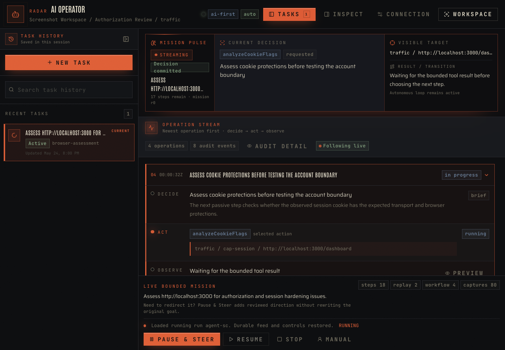

# Radar

Radar is a defensive web security workbench for authorized testing across local, staging, and remote targets. It captures and inspects HTTP/S requests and WebSocket traffic routed through its managed browser or proxy, then brings replay, bounded active testing, evidence, reporting, and a visible AI operator into one desktop app.

Radar is not limited to localhost. Its projects and evidence stay local by default, while saved Scope can cover any authorized HTTP/S origin or WebSocket endpoint.

Use it manually when you want direct control, or give AI-First a scoped goal and watch one sequential browser operator work through the same visible tools and evidence.


## What Radar Does

- **Observe:** capture HTTP/S requests and WebSocket traffic from authorized local or remote targets through the dedicated managed browser or Radar proxy, then explore it through filters, search, request details, and a generated sitemap.
- **Test:** pause and edit traffic, replay requests, run capped payload checks, compare identity evidence, and execute repeatable workflows.
- **Document:** turn captures and test results into evidence-backed findings, retest records, handoff packages, and Markdown or HTML reports.
- **Extend:** install local, permissioned plugins against Radar's bounded SDK.
- **Assist:** use prepare-only AI from the command palette or run a scoped assessment from the separate AI Operator window.

The core workflow is deliberately simple:

1. Create a project and save the authorized scope.
2. Open Radar Browser or connect an external client to the proxy.
3. Capture and inspect the application traffic.
4. Reproduce or test interesting behavior in Repeater, Automate, Identity Lab, or Workflows.
5. Promote resolved evidence into findings and a report.

The [User Guide](docs/USER_GUIDE.md) covers every surface and workflow in detail.

Radar includes six complete appearance systems rather than accent swaps: Bureau, Vellum, Specter, Aperture, Verdigris, and Aegis. The set spans two high-clarity light surfaces and four dark operational environments, with local display, body, and evidence typography tuned for each one.

## AI That Stays Observable

AI-First does not run as a hidden background swarm. One browser operator follows task-relevant in-scope paths, lets each action settle, reads the resulting evidence, and only then chooses the next step.

The companion window keeps a compact **Mission Pulse** and newest-first **Operation Stream** visible. Each operation groups its auditable decision brief, bounded tool action, and persisted observation into one expandable **Decide → Act → Observe** sequence. Older successful operations collapse for density, while the live operation, newest completed operation, failures, policy blocks, and operator-required actions stay open. Permission-gated actions use focused prompts with **Approve Once** and profile-capped **Approve All** choices for matching calls on the same origin, while **Pause & Steer** makes mid-mission direction changes explicit without rewriting the original goal. On completion, Radar reconciles transient Mission Graph states so finished runs do not retain active objectives, testing hypotheses, running experiments, or in-progress coverage. Resume, Stop, and manual workspace controls remain available throughout the run.

The AI Operator connection deck supports the installed Codex app login, Cursor CLI, direct OpenAI, Anthropic, and xAI/Grok API keys, OpenRouter, and custom OpenAI-compatible endpoints. Cloud presets can read provider-specific environment variables, while pasted credentials remain in Radar's local Electron settings and are never exposed to the inspected page.



## Safety Model

- **Local data by default:** projects, captures, findings, workflows, run history, and agent memory are stored in local SQLite; this privacy model does not restrict testing to local targets.
- **Scope is authoritative:** evidence visibility, browser actions, replay, workflows, capability grants, and AI findings all reuse the saved allowlist.
- **Active work is bounded:** sends and workflow requests have explicit caps; burst replay and several mutation/export paths remain Manual-First.
- **Authority is explicit:** AI side effects require the active profile, policy, exact capability lease, and remaining budget to agree.
- **Raw context is opt-in:** headers, bodies, cookies, WebSocket payloads, and storage values are not sent to AI by default.

Radar never installs a root certificate automatically and does not introduce cloud behavior unless you explicitly configure an AI provider.

## Get Started

Pre-built installers are available on the [Releases page](https://github.com/Hairetsu/Radar/releases). Linux releases include AppImage, Debian, and Arch `pacman` packages. See [Install and Launch](docs/USER_GUIDE.md#install-and-launch) for current macOS Gatekeeper, Windows SmartScreen, Linux, and source-build notes.

To run from source:

```bash
pnpm install
pnpm dev
```

Common development checks:

```bash
pnpm test
pnpm test:regression:ui:build
```

`pnpm test` runs lint, unit tests, and the production build. The blocking UI regression command also validates Radar's desktop readability, fonts, zoom behavior, and core usability contracts.

Reproducible test images are provided for Ubuntu and Windows:

```bash
docker build -f docker/Dockerfile.ubuntu -t radar-test:ubuntu .
docker run --rm --init --shm-size=1g radar-test:ubuntu
```

The Ubuntu image runs lint, unit tests, the production build, and the complete Electron/Playwright regression suite under Xvfb. The Windows Server image runs lint, unit tests, the production build, an NSIS package build, and the complete default Electron/Playwright regression suite with GPU acceleration disabled. Build it from a Docker daemon switched to Windows containers:

```powershell
docker build -f docker/Dockerfile.windows -t radar-test:windows .
docker run --rm radar-test:windows
```

The Windows container regression is non-interactive Playwright automation. Windows containers do not provide an interactive desktop, so the native Windows platform matrix remains a Windows-host/VM release gate. See [Regression Testing](docs/REGRESSION_TESTING.md#container-test-images) for artifact mounts, platform requirements, and the equivalent native command.

The first image build needs network access to download the base image, Node, pnpm packages, Electron, and Chromium. After a successful build, those dependencies are baked into the image and the maintained test gates use local fixtures, so the containers can be run without internet access.

## Stack

- Electron 42, React 18, Vite, and strict TypeScript
- Tailwind CSS v4 with CSS-variable themes and local font assets
- SQLite for project, evidence, and run persistence
- Mockttp for local HTTP/S and WebSocket proxying
- Playwright Core over the operator-visible managed Chromium session

Radar uses an installed Chrome, Edge, Brave, or Chromium binary instead of downloading a second browser build.

## Documentation

- [Documentation index](docs/README.md) — operator, engineering, roadmap, and historical references
- [User Guide](docs/USER_GUIDE.md) — installation, navigation, workflows, AI-First, privacy, and troubleshooting
- [Design System](docs/DESIGN_SYSTEM.md) — themes, typography, composition, motion, and accessibility
- [Code Conventions](docs/CODE_CONVENTIONS.md) — architecture boundaries, implementation practices, and testing
- [Regression Testing](docs/REGRESSION_TESTING.md) — release gates and suite operation
- [Branching](docs/BRANCHING.md) — protected-branch and promotion workflow
- [Roadmap](docs/ROADMAP.md) — active product direction

## License

Radar is released under the MIT License.
