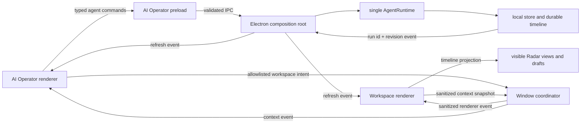

# Radar AI Operator Window Specification

- Status: Implemented
- Spec date: 2026-08-02
- Implementation completed: 2026-08-04
- Primary surfaces: Electron workspace window and Electron AI Operator window

## Executive Summary

Radar replaces the former AI-First operations drawer with a dedicated, app-owned **AI Operator** window. The main Radar window remains the evidence workbench. The AI Operator window is the control plane for prompting, run history, the live agent feed, mission state, capabilities, recovery, findings previews, memory, and AI connection settings.

Implementation note: Electron 42 could not execute the ESM companion preload reliably with renderer sandboxing enabled in packaged regression. The shipped window therefore uses `sandbox: false` with `contextIsolation: true`, `nodeIntegration: false`, a Node-free dedicated preload, a narrow allowlisted API, immutable renderer-role registration, and sender-ID authorization at every privileged IPC boundary. The exception is documented in `docs/CODE_CONVENTIONS.md` and should be re-evaluated with future Electron upgrades.

This is a surface separation, not a second agent implementation. Both windows must use the existing local `AgentRuntime`, shared contracts, policy checks, budgets, scope controls, persistence, and audit history. AI actions continue to change the visible main workbench through typed, allowlisted workspace intents and the existing timeline projection. The AI window must never control the main renderer by injecting JavaScript, querying its DOM, or bypassing the normal Radar feature contracts.

The result should feel closer to a focused agent console beside an IDE:

- The **main window** is where the operator sees evidence, prepared drafts, selected requests, active views, and browser effects.
- The **AI Operator window** is where the operator prompts, follows the feed, steers the mission, reviews capabilities, and handles recovery.
- The main window keeps a compact mission bar with status, current action, attention state, Pause, Stop, and **Open AI Operator**.
- Closing the AI window never hides an active run. The run remains visible and controllable from the main mission bar.

## Why This Change

The existing implementation places the complete AI-First control surface in `AiOperationsDrawer` beside the evidence pane. It is functionally rich, but it creates four product problems:

1. The drawer competes with request, response, finding, workflow, and Automate inspection for horizontal space.
2. Goal composition, run history, the Thoughtstream, Mission Graph, capability ledger, transcript, findings, and memory are compressed into one tall scrolling column.
3. AI connection settings and the Manual-First command palette still appear as main-window overlays, so AI interaction is split among a drawer and dialogs.
4. The drawer looks like an accessory to a view even though AI-First is an app-level operator that moves across all twelve views and the managed browser.

The separate window gives the agent workflow a stable home while allowing the main workbench to use its full width.

## Product Decisions

These decisions are part of the proposed contract, not unresolved options.

| Decision | Contract |
| --- | --- |
| Window count | Radar owns one workspace window and at most one AI Operator window per app process. Repeated open requests focus the existing AI window. |
| Window relationship | The AI window is independent, non-modal, and not always-on-top. It can sit beside the workspace and must not block manual controls. |
| Runtime ownership | There is one existing `AgentRuntime` in the Electron main process. No runtime, provider client, browser controller, or persistence layer is duplicated in either renderer. |
| Default mode | Radar launches in Manual-First. Opening the AI window does not start a run or change mode. A successful **Start Run** transitions Radar to AI-First. |
| Return to Manual | Radar cannot enter Manual-First while an agent run is queued or running. **Return to Manual** first pauses the active run, then changes mode after the checkpoint is durable. |
| Closing the AI window | Closing hides the singleton AI window for the current app lifetime. It does not pause or stop a run. Reopening restores the same UI state. App quit destroys both windows. |
| Main-window AI footprint | Keep a compact mission bar, provider status, contextual AI-prepared state, attention notices, Pause, Stop, and Open/Focus AI Operator. Remove the operations drawer and its reserved width. |
| Manual AI tasks | Keep the contextual Command Palette in the main workspace as the fast Manual-First, prepare-only path. Its **Settings** action opens the AI Operator window directly to Connection settings. |
| AI settings | Move the full AI connection form out of the main overlay and into the AI Operator window. Keep only a connection-status button in the main sidebar. |
| Focus behavior | Agent activity may update the visible workspace without stealing operating-system focus. Only an explicit **Reveal in Workspace** or **Focus Workspace** action brings the main window forward. |
| Theme behavior | Both windows use the same locally bundled theme and fonts. A theme change is reflected in both windows during the same app session. |
| Persistence | Runs, timelines, findings, capabilities, and memory remain in the existing local store. Window bounds and AI window UI preferences are local application preferences, not project evidence. |

## Surface Ownership

### Main Workspace Window

The main window remains the authoritative evidence surface and retains:

- All twelve workbench views and their Manual-First controls.
- The managed-browser toolbar and visible browser state.
- Selected captures, WebSocket frames, findings, workflows, Automate results, and prepared drafts.
- Inline labels or highlights showing where AI has selected, prepared, or changed visible state.
- The contextual Manual-First Command Palette.
- A compact AI mission bar when the AI Operator window is open or a run is active, paused, failed, or awaiting attention.
- Immediate Pause and Stop controls whenever those actions are valid.
- A single **Open AI Operator** or **Focus AI Operator** action.
- A pending-attention indicator for policy blocks, recovery choices, capability review, memory proposals, and finding drafts.

The mission bar must not grow into a second transcript. It shows only:

- Run status and goal.
- Current tool or latest operator-facing decision summary.
- Current visible target.
- Elapsed time or the most urgent budget state.
- Attention count.
- Pause, Resume when appropriate, Stop, and Open AI Operator.

When there is no run and the AI Operator window is closed, the mission bar is absent and the workspace uses the full evidence height.

### AI Operator Window

The AI Operator window owns:

- Goal prompt and composer history.
- Run profile selection and Tutorial Mode.
- Start, Pause, Resume, Continue as New Run, Stop, and Return to Manual.
- Run history and saved-run selection.
- The full durable agent feed.
- Thoughtstream decision briefs, without private chain-of-thought.
- Mission Graph and steering controls.
- Budgets and capability leases.
- Policy blocks and failure recovery.
- Draft finding previews and evidence references.
- Run memory creation, confirmation, dismissal, search, and deletion.
- AI provider connection and model settings.
- Sanitized workspace context: project, session, active view, browser status, and selected evidence reference.

### Content That Must Stay Inline In The Feed

The following items must never exist only behind a secondary inspector tab:

- Failed or policy-blocked tool calls.
- Recovery actions.
- Capability requests requiring operator review.
- Memory proposals requiring confirmation or dismissal.
- Draft findings and finding validation failures.
- Budget exhaustion and sealed-checkpoint state.

The right inspector may summarize and navigate these items, but the chronological feed remains complete and durable.

## AI Operator Layout

- Default window size: `1040 x 840`.
- Minimum window size: `760 x 640`.
- First open: place beside the main window when the active display has room; otherwise center and clamp to the display work area.

The desktop layout uses three purposeful regions rather than one long drawer:

```text
+----------------------+--------------------------------------+--------------------------+
| RUN RAIL             | OPERATOR FEED                        | MISSION INSPECTOR        |
|                      |                                      |                          |
| Current run          | Project / session context            | Graph                    |
| Saved history        | Durable chronological feed           | Budgets                  |
| Search               | Tool and recovery cards              | Capabilities             |
| New mission          | Finding and memory proposals          | Draft findings           |
|                      |                                      | Memory                   |
|                      | Sticky goal / steering composer       |                          |
+----------------------+--------------------------------------+--------------------------+
```

Desktop column targets:

- Run rail: `220-248px`.
- Feed: `minmax(420px, 1fr)`.
- Inspector: `280-320px`.

Responsive behavior:

- Below `940px`, the inspector becomes a slide-in panel opened from the header. Attention items still remain inline in the feed.
- Below `820px`, the run rail becomes a drawer opened from the header. The feed and composer remain the default visible surface.
- The native Electron title bar remains enabled. Radar should not add frameless-window drag regions or custom traffic-light controls in this phase.
- Each region owns its own scrolling. The window document must not develop global horizontal scrolling.
- The composer stays visible at the bottom of the feed while feed history scrolls independently.

### Header

The header shows:

- **AI Operator** identity and current mode.
- Active project and session names.
- Provider/model connection state.
- Main workspace connection state.
- **Focus Workspace**.
- Inspector and run-rail toggles at responsive sizes.
- Connection settings.

### Feed

The feed merges the current Thoughtstream and Observation Console into one chronological stream. Each item has a stable id, timestamp, type, status, short title, operator-facing summary, visible target, and evidence references when present.

Supported visual item types:

- Operator goal or steering message.
- Agent decision brief.
- Tool queued/running/result card.
- Visible workspace or browser effect.
- Policy block.
- Provider or tool failure.
- Recovery action and recovery result.
- Capability request, grant, denial, expiry, and receipt.
- Tutorial lesson checkpoint.
- Finding draft or finding validation rejection.
- Memory proposal, confirmation, or dismissal.
- Pause, resume, continuation, stop, and completion.

Successful passive tool cards may collapse to a concise row. Failures, policy blocks, pending decisions, and the current running action default expanded. Saved history is never truncated; rendering may page or virtualize large runs.

Every card that has a visible target provides **Reveal in Workspace**. The action changes the main view or selection through a typed intent and then focuses the workspace. A passive background update may change the visible main view but must not steal OS focus.

### Composer

The composer supports two states:

- **No active run:** goal text, profile, Tutorial Mode, bounded-budget preview, Start Run.
- **Active or paused run:** steering text, current mission context, Pause/Resume/Stop, and context attachment.

The composer can attach only sanitized, typed references exposed by the main workspace, such as `capture:<id>`, `finding:<id>`, or `workflow:<id>`. It must not pull raw headers, bodies, cookies, storage, or payloads from the main renderer. Raw AI context continues to use the existing explicit opt-in and Electron-side redaction path.

An unsent composer draft is retained locally when the AI window is hidden and restored when reopened. It is scoped to the active project/session and cleared after a successful start or explicit discard.

### Run Rail

The run rail shows:

- New mission action.
- Executing run pinned first.
- Saved runs ordered by update time.
- Status, short goal, profile, and last update.
- Search by goal, status, profile, and run id.
- Continuation relationship when a run was continued with a fresh budget.

Selecting history changes only the inspected run in the AI window. It does not rewind or replace visible main-workspace state. **Reveal latest target** is the explicit action that changes the workspace.

### Mission Inspector

Reuse and recompose the existing `AgentMissionGraph`, `AgentCapabilityLedger`, `AgentTutorialGuide`, finding preview, and Run Memory behavior. The inspector uses sections, not nested modal dialogs. The active budget and any pending capability decision stay visible near the top.

## Mode And Lifecycle Contract

### Opening

The AI Operator can be opened from:

- The main sidebar AI status/control.
- The main mission bar.
- Command Palette connection/settings actions.
- `CommandOrControl+Shift+A`.

Opening the window is reversible and does not start AI, widen Scope, or send provider traffic.

### Starting A Run

1. The AI window validates a non-empty goal and derives the proposed start URL using the existing URL helpers.
2. It reads saved Scope through Electron, not from a duplicated local editor.
3. If the origin is out of scope, it sends a typed `propose-scope-origin` workspace intent.
4. The main workspace focuses Scope, loads the origin into the unsaved editor, and shows the consent notice.
5. No run starts until the operator commits Scope and starts again.
6. On a successful `agent:start`, the main-process coordinator changes mode to AI-First and notifies both windows.
7. The existing runtime, profile, lease, scope, replay, workflow, raw-context, and budget policies remain authoritative.

### While Running

- Electron emits an `agent:changed` notification containing only the run id and monotonic revision.
- Both renderers refetch the normalized run through the existing typed API.
- The main workspace alone applies timeline-derived view and draft projection.
- The AI Operator renders the same durable timeline as a feed but does not maintain a second projection of hidden workbench state.
- Polling remains as a low-frequency recovery path if an event is missed.

### Closing And Reopening

- Hiding the AI window does not change mode or run status.
- If a run is active, the main mission bar remains visible with Pause and Stop.
- Reopening focuses the existing BrowserWindow and restores the selected run, composer draft, rail/inspector state, and scroll anchor when practical.
- A missed UI event is recovered from local persisted run state.

### Returning To Manual-First

- If no run is queued or running, the mode changes immediately.
- If a run is queued or running, Radar pauses it and waits for the durable checkpoint.
- If pause fails, Radar remains AI-First and shows the failure in both surfaces.
- Stopped, completed, failed, and paused runs remain inspectable after returning to Manual-First.
- Manual-First must never coexist with an invisibly running agent.

## Architecture



### Main-Process Window Coordinator

Do not add multi-window lifecycle and routing directly to the already broad `electron/main.ts`. Add a focused module such as:

```text
electron/windows/
  windowCoordinator.ts
  windowState.ts
  windowIntents.ts
  windowCoordinator.test.ts
electron/ipc/
  registerWindowIpc.ts
electron/aiOperatorPreload.ts
```

The coordinator owns:

- Main and AI BrowserWindow references.
- Lazy creation and singleton focus behavior.
- Role lookup by `webContents.id`.
- Initial placement and display-bound clamping.
- Show/hide/focus state notifications.
- Local bounds persistence.
- Main-workspace context caching.
- Allowlisted intent forwarding.
- Mode state and mode-change publication.
- Cleanup when a renderer or app exits.

It does not own agent algorithms, provider calls, browser automation, evidence persistence, or workbench feature state.

### BrowserWindow Configuration

The AI window should use:

- `contextIsolation: true`.
- `nodeIntegration: false`.
- `webviewTag: false`.
- A dedicated, narrow preload.
- The same local Vite page with `?surface=ai-operator` in development and production.
- A native title bar, normal resizability, no `alwaysOnTop`, and no modal parent.
- External-link denial through `setWindowOpenHandler`, opening approved links through `shell.openExternal` as the main window does.

Use `sandbox: true` if the dedicated preload and packaged runtime pass all platform tests. Do not weaken the existing main window while introducing the AI surface.

### Renderer Entry Routing

`src/main.tsx` should render one of two roots after validating the surface query against an immutable role exposed by that window's preload:

```ts
type RendererSurface = "workspace" | "ai-operator";
```

- The workspace preload exposes `workspace`; the AI preload exposes `ai-operator` through a minimal read-only bootstrap value.
- `workspace` renders the existing `App`.
- `ai-operator` renders a new `AiOperatorApp`.
- An absent, unknown, or mismatched surface/role pair renders an explicit blocked-startup screen. It does not silently mount the other application root.

The preload role, not the query string, establishes window authority. A renderer that changes its URL query does not gain another surface's API.

### Shared Contracts

Add a focused shared contract, for example `shared/windowCoordination.ts`:

```ts
export type RadarWindowRole = "workspace" | "ai-operator";

export type WorkspaceContextSnapshot = {
  revision: number;
  mode: "manual-first" | "ai-first";
  activeView: RadarViewId;
  project: { id: string; name: string } | null;
  session: { id: string; name: string } | null;
  browser: { open: boolean; url: string; title: string };
  selection: WorkspaceSelectionRef | null;
  executingRunId: string;
  attentionCount: number;
};

export type WorkspaceControlIntent =
  | { type: "show-view"; view: RadarViewId }
  | { type: "propose-scope-origin"; origin: string; reason: string }
  | { type: "reveal-evidence"; ref: WorkspaceSelectionRef }
  | { type: "reveal-timeline-target"; runId: string; entryId: string }
  | { type: "show-notice"; message: string }
  | { type: "focus-workspace" };
```

`RadarViewId` and selection-reference types that cross IPC must live in `shared/`; renderer-only aliases may re-export them. Every normalizer must clamp string sizes, reject unknown discriminants, validate ids and origins, and return a serializable value.

Do not put full captures, response bodies, storage values, arbitrary selectors, arbitrary CSS, or arbitrary JavaScript in `WorkspaceContextSnapshot` or `WorkspaceControlIntent`.

### Dedicated AI Operator API

Do not expose the full `RadarApi` to the AI window. Define a minimum `RadarAiOperatorApi` containing only:

- Agent run start/pause/resume/recover/steer/capability/stop/get/list operations.
- Agent memory list/save/delete operations.
- AI settings, connection, model, and login operations.
- Read-only active project/session labels and saved Scope targets.
- AI window state and workspace-context reads/subscriptions.
- Allowlisted workspace-intent dispatch.
- Agent-change and mode-change subscriptions.

The AI preload wraps subscriptions and returns unsubscribe functions. It must not expose `ipcRenderer`, Electron objects, filesystem APIs, browser APIs, replay APIs, workflow execution, plugin execution, raw capture reads, or arbitrary channel names.

IPC handlers verify the sender's registered role. The AI window may dispatch workspace intents; an unregistered renderer, target browser, screenshot renderer, or external web content may not.

Agent handlers also apply role-specific allowlists. Start, recovery, steering, and capability mutation belong to the AI Operator role after cutover. Both the workspace and AI Operator roles may read run status and issue Pause or Stop so the main safety controls remain real. Manual-First `ai:run` tasks continue through the main Command Palette contract and are not treated as autonomous agent starts.

### State Ownership

| State | Owner | Synchronization |
| --- | --- | --- |
| Runs, timeline, policies, findings | Existing Electron runtime/local store | Event by id/revision plus refetch; polling fallback |
| Project run memory | Existing local store | Same typed agent-memory API |
| Saved Scope | Existing workspace/local store | Read through Electron; edits remain visible in Scope |
| Active workbench view and selection | Main workspace renderer | Sanitized context snapshot to coordinator |
| App mode | Main-process coordinator | Typed get/set and subscription; defaults Manual-First on launch |
| AI settings and connection status | Existing Electron AI settings/connection boundary | AI Operator owns the editable form; both windows consume a small connection-summary event |
| AI selected history run | AI renderer | Window-local preference; never rewinds workspace automatically |
| Prompt/steering draft | AI renderer | Local app preference keyed by project/session |
| AI window bounds/visibility | Main-process coordinator | Local user-data preference, display-clamped |
| Theme | Existing local theme preference | Add cross-window change subscription/listener |

Do not mount `useRadarWorkbench` inside the AI window. That would duplicate every domain hook, polling loop, selection state, and timeline projection. Extract a focused AI Operator controller instead.

### Agent Hook Refactor

Split the current renderer coupling into focused layers:

1. `useAgentRunStore`: run list, selected run, executing run, refresh, and event/polling hydration.
2. `useAgentRunCommands`: start, pause, resume, continue, stop, recover, steer, and capability updates through the existing preload operations.
3. A pure start-decision helper: validates the goal/start URL and returns `start`, `propose-scope`, or `reject` without mutating React state.
4. `useAgentTimelineProjection`: stays mounted only in the main workspace and continues to apply visible timeline effects through typed workbench ports.
5. `useAiOperatorController`: composes the run store, commands, memory, settings, workspace context, and window-local UI state for `AiOperatorApp`.

The main workspace may consume the shared run store for its mission bar, but it must not own goal-composer or history-inspector state after migration.

Split `useAiConnection` as part of the migration so two renderers do not independently probe the same provider on mount. The AI Operator owns settings editing, model refresh, login, and explicit probes. Electron publishes a bounded `AiConnectionSummary` after those operations, and the main window uses a read-only summary hook for its status control.

## Current-To-Target Code Map

| Current owner | Target change |
| --- | --- |
| `src/components/shell/AiOperationsDrawer.tsx` | Decompose into AI window composer, feed, run rail, inspector, findings, and memory components; delete the drawer container after cutover. |
| `src/components/shell/AiFirstChrome.tsx` | Replace with a main-window mission-bar composition that has no drawer props or inset ownership. |
| `src/components/shell/AgentMissionDock.tsx` | Retain conceptually, rename to `AgentMissionBar`, and limit it to status, visible target, attention, safety controls, and Open AI Operator. |
| `src/hooks/useAiOperationsDrawerLocalState.ts` | Replace with AI-window UI state; remove width/resizer state entirely. |
| `src/hooks/useAiOperationsDrawerController.ts` | Split form submission and memory behavior into focused AI Operator hooks; delete pointer-resize behavior. |
| `src/App.tsx` | Remove `--ai-drawer-inset`, drawer width calculation, and the large drawer prop fan-out. Add the compact mission bar and window-open actions. |
| `src/components/shell/ConsoleControls.tsx` | Replace the two-button mode toggle with a current-mode indicator, AI connection state, and Open/Focus AI Operator. Return-to-manual lives in the mission surfaces and follows pause-first behavior. |
| `src/components/shell/WorkbenchOverlays.tsx` | Remove the main-window AI settings modal. Keep the Manual-First Command Palette and route its settings action to the AI window. |
| `src/ai/AiSettingsPanel.tsx` | Reuse its form behavior as a normal AI Operator settings section instead of a modal backdrop. |
| `src/hooks/workbench/useAgentDomain.ts` | Compose shared run data plus main-only projection; remove ownership of AI-window-only goal/history UI state. |
| `src/hooks/workbench/agent/useAgentRuns.ts` | Split data, commands, and start-decision logic so the AI window can reuse agent behavior without mounting the whole workbench. |
| `electron/main.ts` | Compose a new window coordinator and registrar; do not place companion lifecycle algorithms in the composition root. |
| `electron/preload.ts` | Add only the main-window side of coordination. Use a separate AI Operator preload for the companion window. |
| `src/main.tsx` | Select `App` or `AiOperatorApp` from the validated renderer surface. |

Existing `AgentThoughtstream`, `AgentMissionGraph`, `AgentCapabilityLedger`, `AgentTutorialGuide`, timeline presentation helpers, profile helpers, mission contracts, capability contracts, and runtime operations should be reused.

## Safety And Privacy Requirements

- The Electron main process remains the security boundary.
- The AI window is a trusted local application surface, but it still receives least-privilege preload capabilities.
- Window coordination cannot widen Scope, send replay, run workflows, start Automate, approve plugins, activate identities, forward/drop intercepts, review findings, or export evidence.
- An out-of-scope goal only prepares the unsaved Scope editor in the main window.
- Workspace context is metadata-only unless the existing AI context builder explicitly includes redacted evidence.
- Raw headers, bodies, cookies, storage values, WebSocket payloads, and secrets remain behind the existing raw-context opt-in.
- The AI window must not execute arbitrary code in the workspace renderer or managed browser.
- Every agent action continues through the same runtime policy, lease tuple, saved Scope, budgets, receipts, and audit history.
- Mode changes and window actions never grant a capability lease.
- Closing or losing the AI renderer cannot leave an active run invisible; the main mission bar is the fallback control surface.
- Sender validation uses `webContents.id` matched to a registered window role, not a caller-provided role string.
- Bounds and UI preferences contain no project evidence or secret values.

## Accessibility And Human Usability

- The AI window must be fully keyboard-operable without a modal focus trap.
- Opening from a keyboard shortcut places focus in the composer when there is no active run and in the latest attention item when operator action is pending.
- Feed updates use a restrained `aria-live="polite"` summary region. Do not announce every token or animation frame.
- Pause and Stop remain reachable without scrolling in both windows while a run is active.
- Tool status cannot rely on color alone; use icon, text, and status copy.
- At 80%, 90%, 100%, 125%, and 150% desktop zoom, text remains readable and primary controls remain reachable.
- At the minimum window size, there is no clipped composer, global horizontal scrollbar, overlapping controls, or unreachable inspector/rail content.
- Theme font contracts and the shared `text-*` scale continue to apply. Do not introduce generic system fonts or a separate AI-window design language.
- Motion should emphasize run start, the current tool, attention arrival, and successful workspace reveal. Respect `prefers-reduced-motion` and avoid animating the entire feed continuously.

## Visual Direction

The AI Operator should feel like Radar's mission-control companion, not a generic chat app:

- Use the active Radar theme, distinctive local display/body/mono type, sharp signal accent, rule lines, telemetry, and restrained texture.
- Make the feed the dominant plane, with high information density and clear chronological rhythm.
- Treat tool calls like audit artifacts, not chat bubbles.
- Use asymmetric rail/feed/inspector composition at desktop sizes.
- Give the composer a strong fixed command-deck presence without covering transcript content.
- Use status motion only for the current action or new attention.
- Preserve selectable, readable evidence refs and structured outputs.

## Failure And Edge Cases

| Case | Required behavior |
| --- | --- |
| AI window already exists | Focus and restore it; never create a duplicate. |
| AI window crashes/reloads | Active run continues in main process; main mission bar stays usable; reopening/refetch restores feed state. |
| Main workspace is unavailable | AI window becomes read-only for history/settings, shows **Workspace unavailable**, and rejects view/reveal/start actions that require visible projection. Stop remains available for an active run. |
| App quits with an active run | Existing runtime shutdown behavior applies; no window-specific code silently claims the run completed. |
| Project/session switches | AI window receives a new context revision, clears incompatible selected history/draft attachments, and reloads runs for the active session. |
| Goal proposes new origin | Main Scope editor receives an unsaved proposal; no automatic Commit and no run start. |
| Return to Manual pause fails | Stay AI-First, retain Stop, show the failure in both windows. |
| Display is removed | Clamp the AI window back into the nearest display work area. |
| Theme changes in either window | Both windows update without reload. |
| Event is missed | Low-frequency polling/refetch recovers from persisted state. |
| Saved run has no resolvable target | Feed remains readable; Reveal is disabled with a clear reason. |

## Implementation Plan

### Phase 1 - Contracts And Window Coordinator

- Add shared window-role, context, intent, state, and result types with normalizers.
- Extract `RadarViewId` and serializable evidence-selection references into `shared/`.
- Add the focused window coordinator and `registerWindowIpc` registrar.
- Add singleton create/show/hide/focus, bounds persistence, sender-role validation, and window-state events.
- Add the dedicated AI Operator preload and API type.
- Route the renderer entry by validated surface.
- Render a read-only AI window shell with active project/session and connection state.

Exit check: opening from the main window or shortcut creates exactly one safe AI BrowserWindow, and its preload cannot call unrelated Radar operations.

### Phase 2 - Read-Only Feed And Shared Run Store

- Extract `useAgentRunStore` from the current workbench hook.
- Add event-driven `agent:changed` refresh with polling fallback.
- Build the run rail and durable feed from current run history.
- Reuse Thoughtstream, timeline formatting, Mission Graph, tutorial, capabilities, findings, and memory in read-only form.
- Add responsive rail and inspector behavior.

Exit check: the AI window can inspect the seeded run history and a live run while the main workspace remains full width.

### Phase 3 - Commands, Composer, And Mode Safety

- Add the pure start-decision helper and focused agent command hook.
- Move goal, profile, Tutorial Mode, run lifecycle, recovery, steering, capability, and memory actions into the AI window.
- Add app-mode ownership and subscriptions in the main-process coordinator.
- Implement successful-start-to-AI-First and pause-before-Manual transitions.
- Persist unsent composer state by project/session.

Exit check: a user can start, pause, resume, continue, recover, steer, stop, and return to Manual from the AI window without duplicated runtime state.

### Phase 4 - Visible Workspace Coordination

- Publish sanitized workspace context from the main renderer.
- Validate and forward allowlisted workspace intents.
- Keep timeline projection mounted only in the main workspace.
- Add Reveal in Workspace, Focus Workspace, scope proposal, selected evidence context, active-target highlight, and attention state.
- Ensure normal agent activity updates visible state without stealing OS focus.

Exit check: AI activity visibly controls the main app, and every direct cross-window control is typed, scoped, observable, and fail-closed.

### Phase 5 - Main-Window Cutover

- Replace `AiFirstChrome` and the drawer with the compact mission bar.
- Remove drawer inset, width state, resizer behavior, and prop fan-out from `App.tsx`.
- Move AI connection settings into the AI Operator.
- Route main AI settings actions to the companion settings section.
- Retain the Manual-First Command Palette.
- Delete obsolete drawer-only hooks/components after parity tests pass.

Exit check: no AI operations drawer or AI settings modal remains in the main workspace, and an active run is still safely controllable there.

### Phase 6 - Regression, Documentation, And Release Review

- Add unit, Electron, renderer, and multi-window Playwright coverage.
- Add AI Operator visual baselines for all three themes and supported window/zoom profiles.
- Update README, User Guide, Code Conventions, Manual QA, Regression Suite, Regression Testing, UI visual spec, and screenshots.
- Run the standard lint, unit, build, full UI, and human review gates.

Exit check: automated and human gates prove that the two-window workflow is usable, visible, safe, and stable across supported platforms.

## Test Plan

### Shared And Unit Tests

- Normalize valid window roles, context snapshots, selection refs, and every workspace intent.
- Reject unknown intent types, oversized strings, malformed origins, invalid ids, raw payload fields, and non-serializable values.
- Test start decisions for empty goals, saved-scope goals, out-of-scope proposals, address fallback, and invalid URLs.
- Test mode transitions, including pause-before-Manual success and failure.
- Test run-store event deduplication, stale revision rejection, selected-run fallback, and polling recovery.
- Test project/session draft keying and incompatible attachment clearing.

### Electron Tests

- Opening twice reuses one AI BrowserWindow.
- Focus, hide, reopen, main-close, app-quit, and renderer-crash paths clean up correctly.
- Bounds restore is clamped to available displays.
- The AI window has no webview, Node, filesystem, arbitrary IPC, replay, workflow, plugin, or raw-evidence API.
- Sender-role validation blocks calls from unknown or wrong windows.
- External links cannot navigate the AI window.
- Closing the AI window does not stop an active run.
- Agent and mode events contain ids/revisions rather than unbounded run payloads.

### Renderer Tests

- Main `App` renders no operations drawer and reserves no AI drawer width.
- Idle/manual main workspace has no mission bar.
- Active, paused, failed, and attention states render the correct compact mission controls.
- AI Operator renders composer, history, feed, inspector, settings, memory, and recovery states.
- Failure, policy, memory, finding, and budget items remain inline in the feed.
- Responsive rail/inspector controls preserve feed and composer access.
- Reveal dispatches the correct typed intent and shows an unavailable reason when no target resolves.
- Theme and connection state update across both windows.

### Multi-Window Playwright Tests

Add a dedicated fixture that identifies windows by surface rather than assuming `firstWindow()` is always the only Radar renderer.

Required scenarios:

1. Open the AI Operator from the main window and assert singleton focus on the second open.
2. Start a fake-provider passive run and observe the same run status in both windows.
3. Assert that a `showView` timeline entry changes the main workspace while the feed updates in the AI window.
4. Click Reveal in Workspace and verify view, selection, focus, and visible highlight.
5. Close the AI window during a run; verify the main mission bar and Stop remain usable; reopen and restore the feed.
6. Propose an out-of-scope goal; verify an unsaved Scope proposal and zero agent starts.
7. Return to Manual during a run; verify a durable pause occurs before the mode changes.
8. Switch project/session and verify companion context and run history isolation.
9. Force a failed tool and verify recovery controls in AI plus attention state in main.
10. Verify no raw headers, bodies, cookies, storage values, or payloads appear in the window-context IPC payload.

### Visual Regression Matrix

Capture both windows separately and as a paired desktop layout.

| Surface | Required states |
| --- | --- |
| Main workspace | Idle Manual-First, running mission bar, paused/attention bar, AI-prepared draft highlight |
| AI Operator | New mission, active feed, failure/recovery, Tutorial Mode, saved history, connection settings |
| Paired layout | Workspace and operator side by side with active visible target |

Run the three Radar themes at minimum, default, and wide layouts. Cover 80%, 90%, 100%, 125%, and 150% zoom for usability assertions; keep the existing 200% advisory review policy unless the global UI spec changes.

## Documentation Impact At Implementation

Update these files in the same feature change:

- `README.md`: replace drawer language and refresh product screenshots/design notes.
- `docs/USER_GUIDE.md`: opening, prompting, mode transitions, closing/reopening, recovery, settings, and troubleshooting.
- `docs/CODE_CONVENTIONS.md`: renderer surface roles, dedicated preload rules, sender validation, and cross-window state ownership.
- `docs/MANUAL_QA_CHECKLIST.md`: two-window launch, safety, recovery, focus, project isolation, and close/reopen cases.
- `docs/REGRESSION_SUITE_SPEC.md`: new multi-window functional and safety cases.
- `docs/REGRESSION_TESTING.md`: surface-aware fixtures and window-specific reports.
- `docs/UI_VISUAL_REGRESSION_SPEC.md`: AI Operator sizes, zooms, fonts, paired layout, and baselines.
- `docs/README.md`: keep this specification discoverable through the documentation index.

Completed historical phase documents should not be rewritten as though the separate window had existed when those phases shipped. Add a superseding note only where an old document would otherwise mislead current implementation work.

## Non-Goals

- A second or remote AI runtime.
- Hosted or collaborative agent sessions.
- Multiple simultaneous AI Operator windows.
- Multiple simultaneous active agent runs.
- A generic free-form chat surface detached from Radar evidence.
- Raw hidden chain-of-thought.
- Arbitrary DOM or JavaScript control of the main renderer.
- Moving Manual-First evidence editing into the AI window.
- Making the AI window a modal, always-on-top palette, or embedded browser.
- Changing existing scope, replay, workflow, plugin, identity, raw-context, finding-review, or export safety policy.
- Replacing the managed target browser window.

## Release Acceptance Criteria

The feature is complete only when all of the following are true:

- The main evidence pane never reserves space for an AI drawer.
- The AI Operator is a singleton, safe, independently resizable Electron window.
- Prompting, feed, history, Mission Graph, capabilities, recovery, findings previews, memory, and AI settings are usable in the AI window.
- The main window retains provider state, visible AI effects, current mission state, attention, Pause, Stop, and Open/Focus AI Operator.
- Starting a run visibly transitions to AI-First; returning to Manual cannot leave a queued or running agent hidden.
- Agent actions still use the existing runtime, saved Scope, capabilities, budgets, receipts, evidence gates, and local persistence.
- The AI window can visibly steer/reveal the main workspace only through typed, normalized, sender-validated intents.
- No raw context crosses the window-coordination contract.
- Closing, reopening, reloading, or crashing the AI renderer does not lose a durable run or remove main-window safety controls.
- Project/session switching never mixes run history, composer attachments, or memory.
- Minimum-size, font, zoom, focus, reachability, and visual-diff gates pass for both windows in all themes.
- `pnpm lint`, `pnpm test:unit`, `pnpm build`, the multi-window regression suite, the UI regression suite, and the human usability review pass.

## Recommended Delivery Order

Execute Phases 1-2 as a read-only companion first, then move mutation controls in Phase 3. Keep the current drawer available only during development until command parity, mode safety, and multi-window recovery tests pass. Perform the final drawer removal and documentation screenshot refresh in one cutover change so the shipped product never exposes two competing AI control planes.
