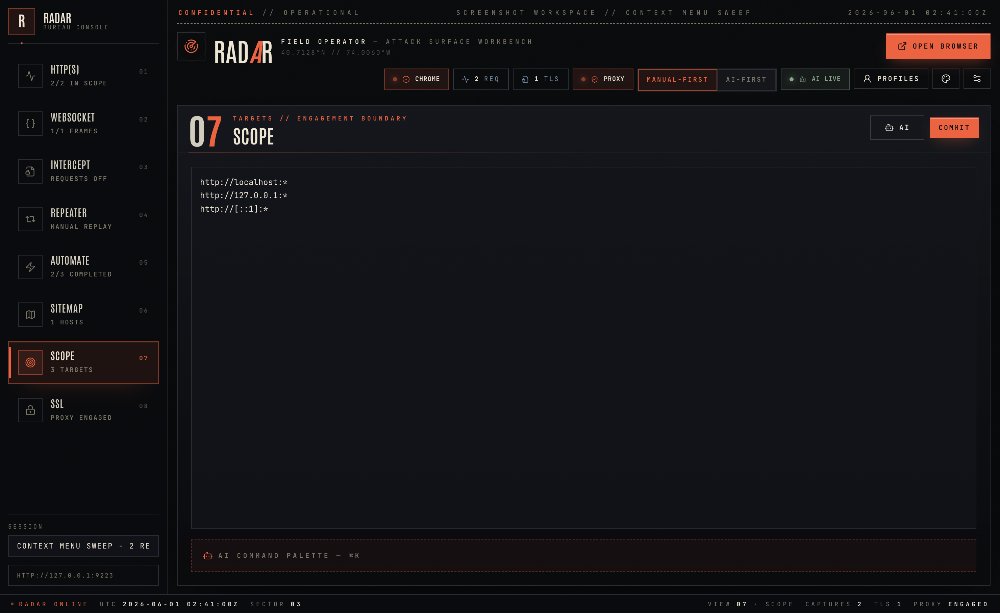
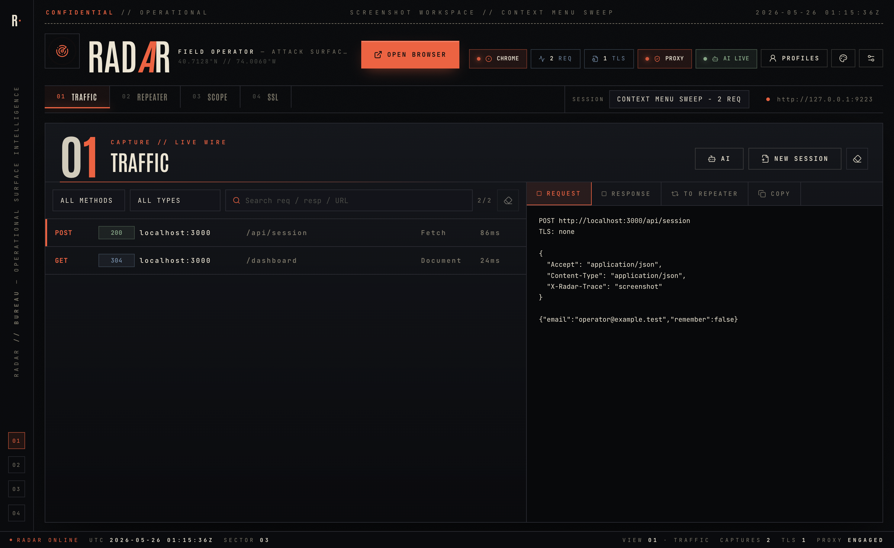
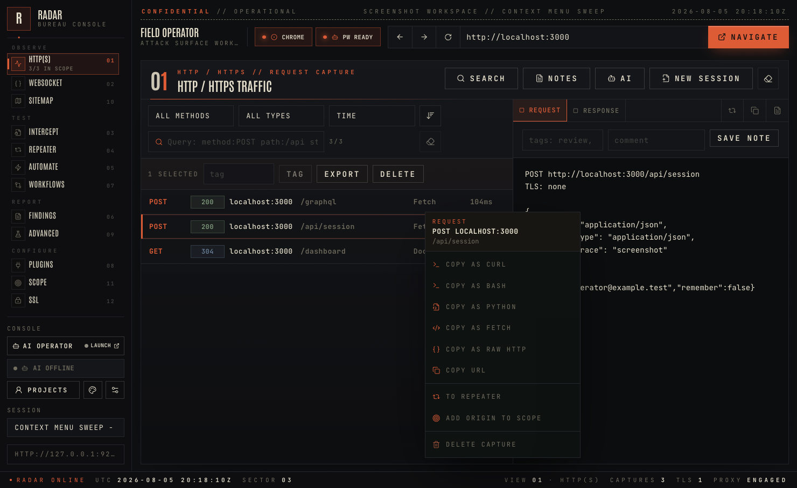
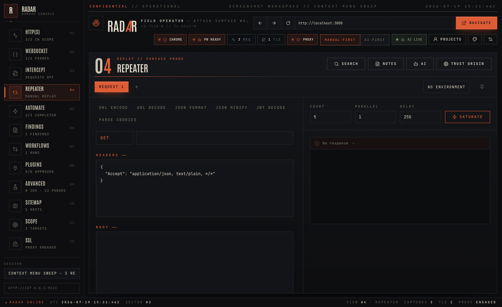
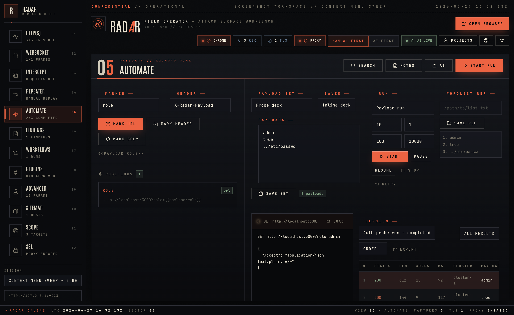
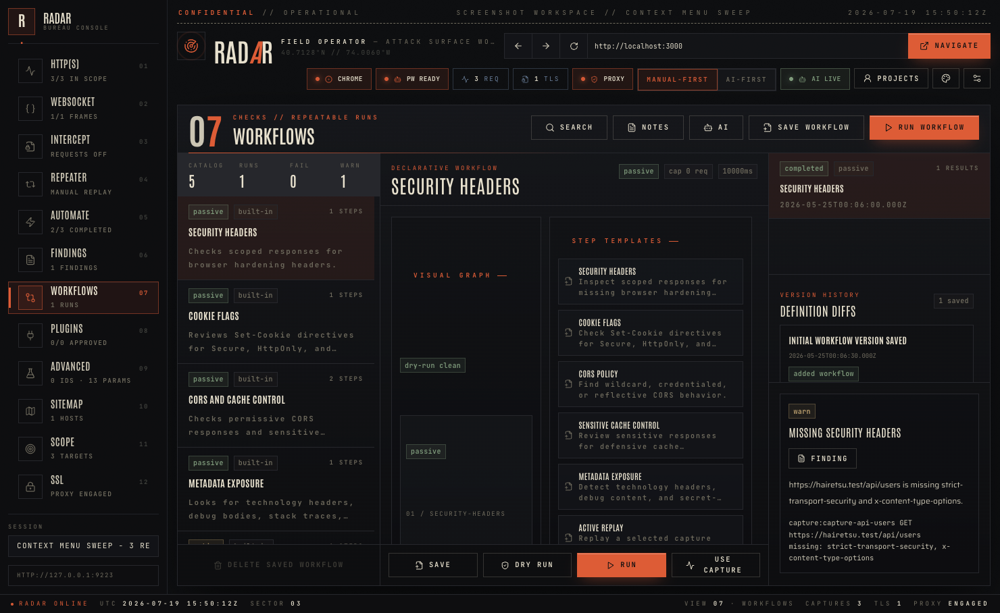
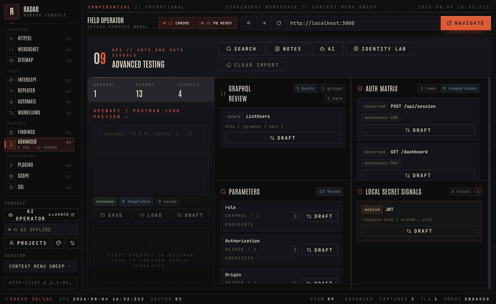
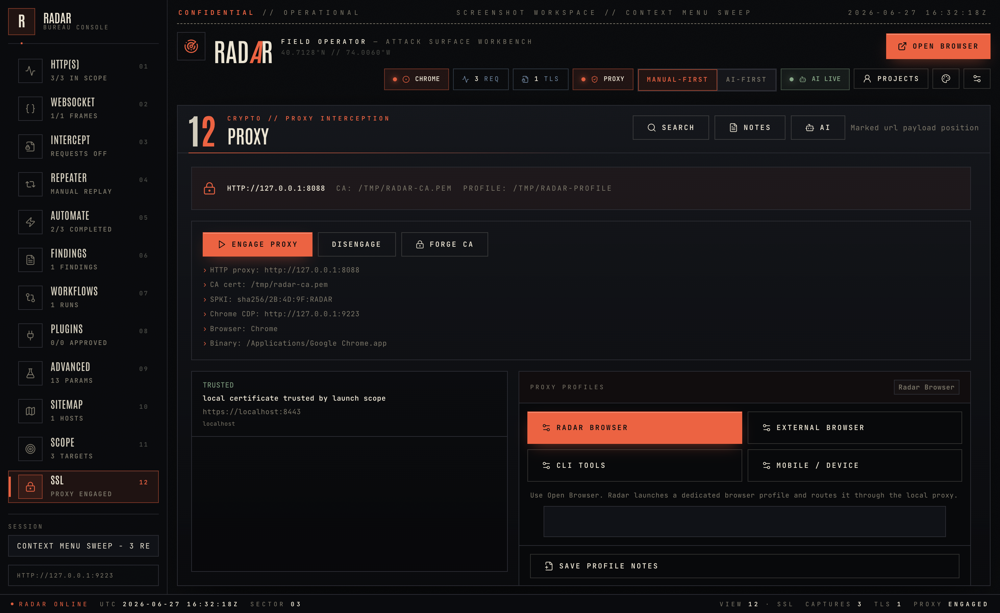
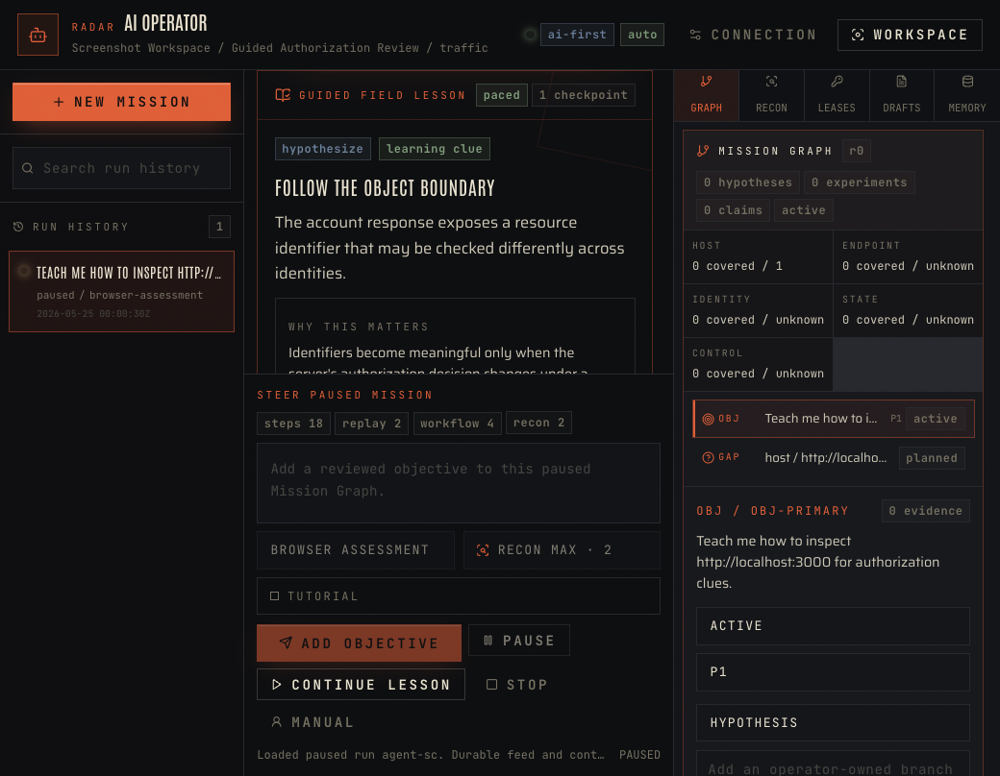
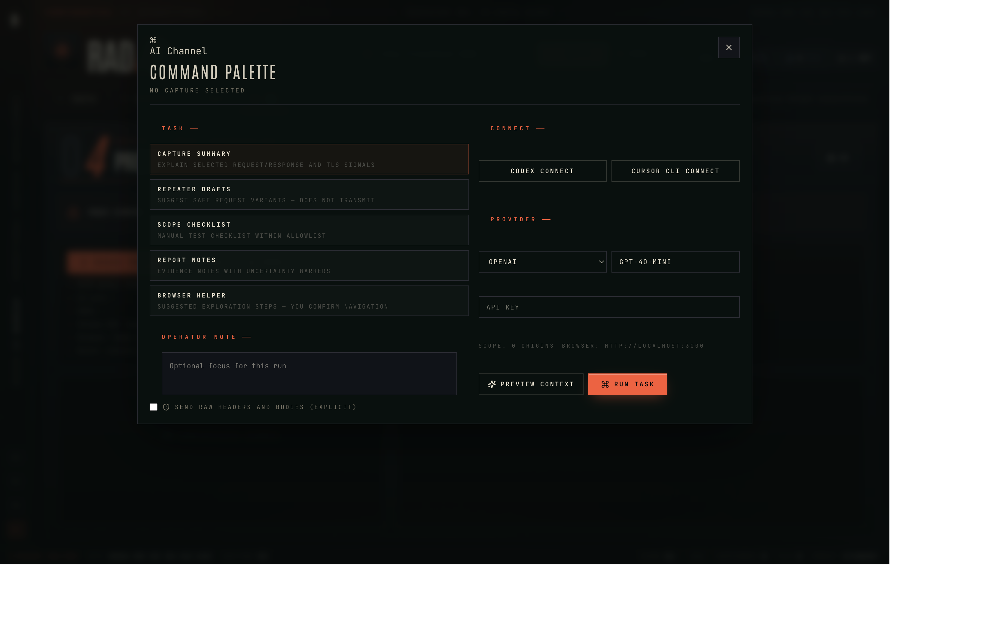

# Radar User Guide

Radar is a local-first defensive web security workbench for capturing HTTP/S and WebSocket traffic, inspecting request, response, and frame evidence, replaying requests, running bounded payload-marker tests, running repeatable workflows, managing local plugins, reviewing advanced API/auth signals, creating evidence-backed findings and reports, managing engagement scope, reviewing TLS/proxy behavior, and running AI-assisted analysis. Manual-First keeps AI prepare-only for risky actions; AI-First lets a scoped agent choose bounded tools while you watch.

This guide covers the app as it exists now: the main console, global search, projects and sessions, HTTP/S capture and query filters, WebSocket analysis, sitemap mapping, request interception, repeater, Automate sessions, workflows, plugins, advanced testing helpers, findings and reports, scope management, SSL/proxy setup, AI features, appearance settings, local data, and troubleshooting.

## Table Of Contents

- [What Radar Is For](#what-radar-is-for)
- [Safety Model](#safety-model)
- [Install And Launch](#install-and-launch)
- [Main Console Tour](#main-console-tour)
- [Global Search](#global-search)
- [Project Notes And Saved Views](#project-notes-and-saved-views)
- [Project Bundle Export And Import](#project-bundle-export-and-import)
- [Handoff Packages](#handoff-packages)
- [Projects And Sessions](#projects-and-sessions)
- [Scope](#scope)
- [Opening The Radar Browser](#opening-the-radar-browser)
- [HTTP And HTTPS Traffic](#http-and-https-traffic)
- [WebSocket](#websocket)
- [Sitemap](#sitemap)
- [Intercept](#intercept)
- [Repeater](#repeater)
- [Automate](#automate)
- [Findings](#findings)
- [Workflows](#workflows)
- [Plugins](#plugins)
- [Advanced Testing](#advanced-testing)
- [Identity Lab](#identity-lab)
- [SSL And Proxy](#ssl-and-proxy)
- [AI Command Palette](#ai-command-palette)
- [Appearance](#appearance)
- [Local Data And Privacy](#local-data-and-privacy)
- [Common Workflows](#common-workflows)
- [Troubleshooting](#troubleshooting)
- [Glossary](#glossary)

## What Radar Is For

Use Radar when you need a controlled local workbench for authorized web security testing:

- Launch an isolated browser profile through Radar.
- Capture HTTP, HTTPS, and WebSocket traffic from the Radar browser or an external browser configured to use Radar's proxy.
- Filter captured HTTP/S requests and WebSocket frames with a scoped query language or saved filters.
- Search across local project evidence and artifacts from one overlay.
- Save local project notes and saved views for handoff and repeatable review posture.
- Export and import local project bundles with explicit redaction and import preview.
- Export focused handoff packages for reviewed findings and referenced evidence.
- Map discovered hosts, paths, and endpoints in a sitemap with inventory and session diff.
- Tag, comment on, and bulk-manage captured evidence.
- Inspect selectable request, response, and frame evidence.
- Copy evidence for notes or reports.
- Clone captured requests into a manual repeater.
- Send a single replay or a capped burst replay for hardening checks.
- Mark payload positions in a request draft, run capped Automate sessions, cluster results, and promote interesting attempts to Repeater or Findings.
- Create durable findings with evidence references, retest notes, and Markdown/HTML report export.
- Save and rerun declarative workflows for passive checks and selected scoped active replay checks.
- Install local plugins from disk with explicit permission approval and SDK/API boundaries.
- Review GraphQL, imported API definitions, auth-state behavior, isolated identity evidence, parameter inventory, local secret signals, cache/header behavior, and proxy guidance from scoped evidence.
- Review proxy, certificate, and TLS signals.
- Ask AI for summaries, report notes, checklist ideas, safe repeater drafts, browser exploration suggestions, TLS review, WebSocket frame analysis, or a bounded AI-First run.

Radar is not an exploitation automation tool. It is built around explicit scope, local evidence, operator-visible timelines, and bounded replay budgets.

## Safety Model

Radar is designed for defensive, authorized work.

- Scope controls what appears in HTTP/S and WebSocket evidence views and what the AI can use as app context.
- The default scope is local development only.
- AI context is redacted by default. Raw headers, bodies, and WebSocket payloads require explicit opt-in in the command palette.
- Manual-First AI tasks are prepare-only. AI-First can navigate, inspect, and send strictly capped replay probes, but only through saved-scope policy checks.
- Radar never installs a root certificate automatically.
- Radar stores captures, WebSocket frames, findings, workflows, targets, sessions, proxy CA files, AI settings, and custom skills locally on your machine.
- Manual replay is operator-driven. AI-First replay is scope-checked and capped separately.
- Burst replay is capped to reduce accidental load and is not available to AI-First.
- Automate execution is Manual-First only. AI-First can prepare visible payload/rule controls and analyze existing results, but it cannot start invisible payload runs.
- Workflow execution always uses saved workflow definitions, scope policy, and caps. AI-First can choose existing workflows by id; it cannot invent hidden workflow behavior.
- Plugin install, approval, disable/block/remove, and live execution are Manual-First operator actions. AI-First can read approved plugin inventory but cannot approve plugins, widen permissions, or run hidden plugin actions.
- Advanced testing import previews are Manual-First and text-only. AI-First can read a local Advanced summary, but it cannot import files, create replay traffic, or run imported requests invisibly.
- Identity Lab roster/context is metadata-only. Raw cookie and storage values remain in the Electron main process and dedicated browser profile; including raw values in AI context still requires the existing explicit raw-context opt-in.
- Identity health, status codes, matrices, and recorded differentials are observations, not proof that an action was authorized.
- Finding export is Manual-First only. Evidence appendices are redacted by default, and raw evidence requires an explicit export toggle.

Use Radar only on systems, domains, and environments where you have permission to test.

## Install And Launch

### Install From A Release

Prebuilt installers are published on the [Radar GitHub Releases page](https://github.com/Hairetsu/Radar/releases).

#### macOS

Radar is not notarized yet. If macOS blocks launch with a verification or damaged-app warning:

1. Move `Radar.app` to `/Applications`.
2. Run:

```bash
sudo xattr -dr com.apple.quarantine /Applications/Radar.app
```

3. Open Radar normally.

#### Windows

Run the `.exe` installer. If SmartScreen appears, choose **More info**, then **Run anyway**.

#### Linux

For AppImage:

```bash
chmod +x Radar-*.AppImage
./Radar-*.AppImage
```

For Debian package:

```bash
sudo apt install ./radar_*_amd64.deb
```

### Run From Source

For users testing the app from the repository:

```bash
pnpm install
pnpm dev
```

Useful source commands:

| Command | Use |
| --- | --- |
| `pnpm dev` | Start Vite and open the Electron app. |
| `pnpm build` | Build the renderer and Electron main process. |
| `pnpm test` | Run lint, unit tests, and production build. |
| `pnpm test:regression:build` | Build Radar and run isolated Playwright Electron workflows in parallel. |
| `pnpm test:regression:ui:build` | Build Radar and run the blocking UI, local-font, zoom, focus, and usability matrix. |
| `pnpm test:regression:ui:full` | Build Radar and run the scheduled 183-image view/theme/window/zoom screenshot matrix. |
| `pnpm test:regression:report` | Open the latest interactive regression report. |
| `pnpm screenshots` | Rebuild and refresh screenshot assets. |
| `pnpm pack` | Build an unpacked desktop app with electron-builder. |
| `pnpm dist` | Build release distributables. |

Use [docs/MANUAL_QA_CHECKLIST.md](MANUAL_QA_CHECKLIST.md) for the twelve-view release, screenshot, demo, and onboarding QA pass.
Use [docs/REGRESSION_TESTING.md](REGRESSION_TESTING.md) for multi-instance regression execution, artifacts, and the automation expansion matrix.

## Main Console Tour

Radar opens into a twelve-view operator console.

Persistent areas:

- **Left sidebar**: Radar lockup and grouped Observe, Test, Report, and Configure navigation. The active view shows its live count in context. Below 1180px the sidebar becomes a horizontal strip along the top of the window: use the chevron buttons at either end to page through the views, scroll the strip with the mouse wheel or a trackpad swipe, or move through it with the keyboard. The chevrons appear only while views are off screen and dim at each end, and the active view is always scrolled back into sight — including when AI-First changes views for you.
- **Console block**: app-global controls at the foot of the sidebar — current Manual-First / AI-First status, AI connection status, **Open AI Operator**, Projects, and Appearance.
- **Top banner**: active project workspace/session and UTC clock.
- **Header**: active project name, managed-browser address/history controls, browser and Playwright status, global Search, project Notes, and view-specific actions. The header tracks the current target; app-global controls live in the sidebar Console block.
- **Session selector**: quick session switching under the Console block.
- **Workspace panel**: the active evidence or tool surface. AI-First adds a compact mission safety bar without replacing or narrowing the active view; detailed prompting and run review live in the separate AI Operator window.
- **Footer ticker**: current view, HTTP/S capture count, WebSocket frame count, TLS event count, and proxy status.

Views:

| View | Purpose |
| --- | --- |
| **01 HTTP(S)** | In-scope HTTP/S request log, query filters, tags/comments, and request/response inspector. |
| **02 WebSocket** | In-scope WebSocket handshakes, frames, payloads, errors, closes, and query filters. |
| **03 Intercept** | Scoped proxy request pause, edit, forward, drop, and resume controls. |
| **04 Repeater** | Manual request editor, single replay, and burst replay. |
| **05 Automate** | Explicit payload markers, saved payload sets, bounded sessions, result table, clustering, and match/extract rules. |
| **06 Findings** | Evidence-backed findings inbox, templates, retest tracking, and Markdown/HTML report export. |
| **07 Workflows** | Built-in and saved declarative checks, scoped run history, and result promotion to Findings. |
| **08 Plugins** | Local plugin manifest preview, permission approval, registry controls, SDK/API boundary, and panel inventory. |
| **09 Advanced** | GraphQL review, API import preview, auth matrix, Identity Lab, parameter discovery, local secret detection, header behavior, and proxy guidance. |
| **10 Sitemap** | Host/path/endpoint map, endpoint inventory, session diff, and jump-to-traffic queries. |
| **11 Scope** | Engagement boundary and target allowlist. |
| **12 SSL** | Proxy controls, generated CA details, TLS event log, and TLS metadata. |

## Global Search

Open global search with **Search** in the workspace header or `Cmd+P` / `Ctrl+P`.

Global search covers local data for the active project/session:

- In-scope HTTP/S captures, including request/response headers, bodies, tags, and comments.
- In-scope WebSocket frames, including payloads, headers, tags, and comments.
- Repeater tab drafts, replay history, and saved collection items.
- Findings, affected assets, evidence refs, notes, reproduction, impact, and remediation.
- Workflow definitions and workflow run results.
- Plugin names, descriptions, permissions, panels, warnings, and status.
- Advanced testing signals from scoped evidence, including GraphQL, auth matrix, parameters, secrets, header behavior, and proxy guidance.
- Saved HTTP(S) and WebSocket filters.
- Project notes.
- Saved views.

Useful query examples:

```text
session cookie
kind:capture host:api.example.test status:403
kind:websocket source:received "session:update"
kind:finding severity:high status:draft authorization
kind:replay status:500
kind:advanced source:cache-poisoning
kind:saved-filter status:401
kind:note "auth handoff"
kind:saved-view traffic
```

Supported filters are `kind`, `host`, `path`, `status`, `severity`, and `source`. Text terms are matched across the searchable fields for each result. Capture and WebSocket results remain scope-filtered; out-of-scope traffic is not returned. Opening a result switches to the source view and selects or loads the closest visible object when that view supports direct selection.

HTTP header values, bodies, and WebSocket payloads are indexed through Radar's default sensitive-value redaction. Search can locate surrounding evidence without making bearer tokens, cookies, API keys, or token-shaped payload values directly searchable.

Opening a project note result opens the Notes panel and selects that note. Opening a saved-view result applies the saved view state.

## Project Notes And Saved Views

Open **Notes** in the workspace header to manage local project artifacts that are useful across sessions.

Project notes are workspace-local. Use them for engagement context, target owner details, safe test credentials, retest reminders, hypotheses, and handoff context. Notes are searchable with `kind:note` and remain local unless you explicitly copy them or include relevant context in an AI task.

To save a note:

1. Click **Notes**.
2. Click **New** or select an existing note.
3. Enter a title, body, or both.
4. Click **Save Note**.

Saved views store the active workbench view plus useful local state:

- Traffic and WebSocket queries.
- HTTP method and resource-type filters.
- Selected capture, finding, workflow, workflow run, sitemap node, baseline session, Automate run, and Repeater tab when present.

To save the current view:

1. Navigate to the view and state you want to preserve.
2. Click **Notes**.
3. Enter a saved-view name and optional description.
4. Click **Save Current View**.

To return to a saved view, open **Notes** and click **Open** on the saved view, or search for it with global search using `kind:saved-view`.

## Project Bundle Export And Import

Project bundles are local JSON files for moving project context between Radar installs or teammates. Open **Notes**, then use the **Project bundle** panel.

Export profiles:

| Profile | Contents |
| --- | --- |
| **Metadata Only** | Request/frame metadata, project artifacts, findings, workflows, and no raw headers, bodies, WebSocket payloads, or workflow run details. |
| **Redacted Evidence** | In-scope HTTP/S and WebSocket evidence with sensitive headers and payloads redacted. This is the default. |
| **Reviewed Findings** | Reviewed findings plus only referenced evidence, with evidence redacted. Draft findings are excluded. |
| **Raw Evidence** | Full headers, bodies, cookies, auth values, and WebSocket payloads. Use only after explicit operator approval. |

To export:

1. Click **Notes**.
2. Choose a redaction profile.
3. Decide whether to include Repeater collections and plugin metadata.
4. Click **Preview Export** and review counts/warnings.
5. Click **Export Bundle** and choose a destination.

Plugin records are exported as metadata only; imported plugins still need local install/approval before they can run.

To import:

1. Click **Notes**.
2. Enter a bundle path or leave the path blank to use the file picker.
3. Click **Preview Import**.
4. Review counts, conflicts, warnings, and inactive proposed scope targets.
5. Click **Apply Import**.

Import creates local imported sessions under the active project and writes imported evidence, findings, notes, saved views, workflows, and collections there. Existing workspace records with matching ids are preserved and duplicate imported records are skipped. Import does not execute workflows, run plugins, send replay traffic, start AI, or add proposed targets to active scope. If a bundle proposes targets, copy them into **11 Scope** only after review.

## Handoff Packages

Handoff packages are focused exports for another operator, report writer, or retest pass. They are smaller than project bundles and are built from findings plus their referenced evidence.

Open **Notes**, then use **Handoff package**.

Defaults:

- Reviewed findings are included.
- Draft findings are excluded unless **Include draft findings** is checked.
- Only evidence referenced by included findings is packaged.
- Project notes, workflows, and Repeater collections can be included or excluded.
- The same redaction profile selected for project bundles applies to the handoff package.
- A Markdown handoff summary is embedded in the JSON package.

To export:

1. Enter a handoff title.
2. Choose the redaction profile in the **Project bundle** section.
3. Decide whether to include draft findings, project notes, workflows, and Repeater collections.
4. Click **Preview Handoff** and review counts/warnings.
5. Click **Export Handoff** and choose a destination.

Use **Raw Evidence** only when the recipient is authorized to receive full headers, bodies, cookies, authorization values, and WebSocket payloads.

## Projects And Sessions

Radar separates local work into projects and sessions. The persisted contract still uses local profiles internally, but the operator-facing term is **project**.

### Projects

A project represents an operator, client, engagement, or testing context. It owns:

- A local workspace.
- Scope targets.
- Project notes and saved views.
- Installed plugin records.
- A dedicated launched-browser profile directory.
- Sessions created under that workspace.

Use projects when you need to separate clients, accounts, environments, or testing contexts. Switching projects can stop the launched Radar browser so browser state stays isolated.

### Sessions

A session is a capture ledger for a specific testing run. It tracks:

- HTTP/S captures.
- WebSocket frames.
- Findings and report-ready evidence references.
- Saved workflow definitions and session workflow runs.
- SSL events.
- Session name and timestamps.

Use sessions for separate test passes, retests, environments, or report evidence windows.

### Open The Projects Panel

Click the project/session control in the sidebar.

In the panel you can:

- Rename and save the active project.
- Create a new project.
- Load an existing project.
- Load or refresh the seeded demo project.
- Rename and save the active session.
- Create a new session.
- Load an earlier session.
- See capture and TLS event counts for saved sessions.

### Load The Demo Project

In the projects panel, click **Load Demo** to create or refresh the **Radar Demo Project** and **Seeded Walkthrough** session. The demo project seeds local HTTP/S captures, WebSocket frames, evidence tags, saved filters, Repeater data, Automate results, findings, workflow history, an approved demo plugin record, Advanced testing signals, TLS evidence, and an AI-First run history.

Use the demo project for screenshots, manual QA, onboarding, and product walkthroughs. Re-running **Load Demo** refreshes the same demo project with stable record ids instead of duplicating evidence. It does not send traffic or modify other projects.

### Quick Session Selector

The sidebar includes a **Session** dropdown. Use it to jump between existing sessions under the active project.

### Clear A Session's Captures

In **01 HTTP(S)**, click the eraser icon in the panel header to clear HTTP/S captures for the active session. In **02 WebSocket**, click the eraser icon to clear WebSocket frames. Neither action deletes the profile, session, or scope targets.

## Scope

Scope is the engagement boundary. HTTP/S and WebSocket views only show evidence whose URL matches the active allowlist.



Default scope:

```text
http://localhost:*
http://127.0.0.1:*
http://[::1]:*
```

### Add Targets

Open **11 Scope**, then enter one target per line:

```text
https://staging.example.com
https://api.staging.example.com
https://*.internal.example.com
example.test
local
```

Click **Commit** to save.

### Scope Rule Behavior

Radar accepts:

| Rule Type | Example | Behavior |
| --- | --- | --- |
| Origin | `https://staging.example.com` | Matches that exact origin. |
| Hostname | `example.test` | Matches the hostname regardless of scheme. |
| Wildcard | `https://*.example.com` | Matches wildcard patterns against the origin or full URL. |
| Local keyword | `local` | Matches localhost, `127.x.x.x`, and `[::1]`. |

WebSocket URLs match equivalent HTTP origins. For example, `ws://example.test` matches `http://example.test`, and `wss://example.test/socket` matches `https://example.test`.

Blank lines are ignored. If all targets are removed, Radar falls back to the default local development scope.

### Trust Origin From Repeater

In Repeater, click **Trust Origin** to add the current request URL's origin to scope.

## Opening The Radar Browser

Enter a target in the header address bar and click **Open Browser**. After launch, the same toolbar provides **Back**, **Forward**, **Reload**, and **Navigate** without restarting Chrome.

Radar looks for a supported local browser:

- Google Chrome
- Google Chrome Canary on macOS
- Chromium
- Microsoft Edge
- Brave Browser on macOS

When Radar launches the browser it:

- Uses a Radar-owned profile directory instead of your normal browser profile.
- Starts the local Radar proxy if needed, preferring port `8088` and selecting a nearby open port when managed-browser startup finds it occupied.
- Routes browser traffic through Radar's proxy.
- Opens remote debugging on `127.0.0.1:9223`, or a nearby open loopback port when `9223` is occupied.
- Connects Playwright Core to that loopback endpoint and keeps it attached to the visible managed page.
- Uses a launch-scoped certificate exception for Radar's generated proxy CA fingerprint.
- Uses a mock keychain flag on macOS where supported to avoid prompting for your login keychain.

The header shows a `pw ready` status when AI page control is available. The SSL view shows the selected browser channel, binary path, profile path, proxy URL, Chrome remote debugging endpoint, Playwright status, page count, and any connection error.

Manual-First uses the same browser and proxy path as AI-First. You can operate the Chrome window directly or use Radar's address/history controls; captured traffic appears in the normal evidence views either way.

### Address Behavior

Radar normalizes bare addresses. For example:

```text
example.com
```

becomes:

```text
https://example.com
```

Empty addresses fall back to:

```text
http://localhost:3000
```

## HTTP And HTTPS Traffic

HTTP(S) is the in-scope request and response capture log. WebSocket traffic is intentionally split into its own tab.



Each row shows:

- HTTP method.
- Status code.
- Host.
- Path.
- Resource type or source.
- Duration.

HTTP(S) only lists captures that match the active scope rules and start with `http://` or `https://`. If requests are happening but the list is empty, check the Scope view first. If the app uses WebSockets, open **02 WebSocket**.

### Filter HTTP/S Traffic

Use the toolbar to narrow by method, resource type, sort field, and sort direction. The search bar accepts a scoped query language or plain text.

**Structured queries** use field predicates with optional comma-separated values:

```text
method:POST path:/api status:401,403 mime:json
host:staging.example.com req.header:authorization
tag:auth comment:session
```

Supported fields include `method`, `host`, `path`, `url`, `status`, `mime`, `type`, `source`, `initiator`, `req.header`, `resp.header`, `req.body`, `resp.body`, `tag`, and `comment`. Combine terms with `AND`, `OR`, and `NOT`. Quote values that contain spaces.

**Plain text** without field syntax falls back to substring search across method, URL, host, path, status, MIME type, source, headers, and bodies.

**Saved filters** persist per workspace. Save the current query from the filter chips, then reapply it later from the same chip row. Click the eraser icon to clear active filters.

**Keyboard shortcuts:**

- `Cmd+F` / `Ctrl+F` focuses the traffic search bar.
- `Escape` clears the active query when the search bar is focused.

### Tag And Comment On Captures

Select a capture to open tag and comment fields above the detail pane. Tags and comments persist for the active session and can be queried with `tag:` and `comment:` predicates.

### Bulk Actions

Multi-select captures with Cmd/Ctrl-click and Shift-click. When more than one row is selected, the bulk action bar supports bulk tag, export, and delete. Bulk export redacts sensitive request headers and token-shaped body values by default; use an explicitly raw, single-request action only when exact secret-bearing evidence is intentionally required.

### Select Captures For AI

Click a row to select one capture. Cmd/Ctrl-click toggles individual rows. Shift-click selects a range from the current anchor. The AI command palette uses this selection as the initial packet set, and you can still adjust it inside the palette.

### Inspect A Capture

Select a row to open the detail pane.

Tabs:

- **Request**: method, URL, TLS line, request headers, request body.
- **Response**: status, TLS line, response headers, response body.

The detail pane is selectable so you can copy evidence.

### Copy Evidence

Click **Copy** in the detail pane. Radar copies whichever detail tab is active.

### Request Context Menu

Right-click an HTTP/S row or the request/response detail pane to open request actions.



Available actions:

- Copy as cURL.
- Copy as Bash.
- Copy as Python.
- Copy as Fetch.
- Copy as raw HTTP.
- Copy URL.
- Send to Repeater.
- Add the request origin to Scope.
- Delete the capture.

### Clone Request

Click **Repeater**. Radar copies the selected request into Repeater with:

- Method.
- URL.
- Request headers.
- Request body.

## WebSocket

WebSocket is the in-scope stream and frame analyzer.

Radar captures WebSocket traffic separately from HTTP/S traffic. It records:

- Client handshake requests.
- Server handshake responses.
- Frames sent by the browser/client.
- Frames received from the server.
- Frame errors.
- Close events.

The proxy has a dedicated WebSocket passthrough rule, so controlled Chrome and external browsers can load WebSocket apps while Radar records frame events. Electron-attached pages can also contribute CDP WebSocket frame events.

### Filter WebSocket Frames

Use the toolbar to filter by direction: all, handshake, sent, received, error, or closed. The search bar accepts the same scoped query language as HTTP(S), with WebSocket-specific fields such as `direction`, `opcode`, `payload`, and `error`.

Examples:

```text
direction:sent payload:ping
host:staging.example.com direction:received
```

Plain text without field syntax falls back to substring search across URL, host, payload, direction, opcode, status, and error.

Click the eraser icon in the toolbar to clear active filters. `Cmd+F` / `Ctrl+F` focuses the WebSocket search bar; `Escape` clears the active query when focused.

### Inspect A Frame

Select a frame to open the detail pane. The detail includes:

- Frame URL and connection id.
- Host.
- Direction.
- Opcode.
- Size.
- Status or close code when present.
- Request and response handshake headers.
- Payload preview or copied payload text.

Click **Copy** in the detail pane to copy the active frame detail.

### Select Frames For AI

Click a frame to select one frame. Cmd/Ctrl-click toggles individual frames. Shift-click selects a range from the current anchor. Selected frames are passed into the AI command palette as WebSocket packet evidence, alongside any selected HTTP/S captures.

### Clear WebSocket Frames

Click the eraser icon in the WebSocket panel header. This clears WebSocket frame history for the active session and does not remove HTTP/S captures.

## Sitemap

Sitemap is the host, path, and endpoint map for scoped HTTP/S traffic in the active session.

Open **10 Sitemap** to browse discovered structure without leaving Radar.

### Tree Navigation

The left tree groups:

- Hosts.
- Paths under each host.
- Endpoint families by method and status.

Select a node to inspect coverage counts and jump into matching HTTP(S) traffic with a prepared query.

### Endpoint Inventory

Selecting an endpoint opens inventory details for:

- Query parameters seen in captured requests.
- JSON body keys and form fields.
- Content types.
- Auth signals such as bearer tokens, cookies, and API keys.

Use **Open in HTTP(S)** to apply a matching query in the traffic tab.

### Session Diff

The right pane compares the active session against an earlier session under the same project. Pick a baseline session, then review:

- Added endpoints.
- Removed endpoints.
- Status changes.
- Header changes.
- Response-shape changes.

Session diff helps retests and regression checks without exporting captures manually.

## Intercept

Intercept is the Manual-First request pause and mutation surface for scoped proxy traffic.

Open **03 Intercept** and click **Requests Off** to switch request interception on, or **Responses Off** to switch response interception on. Request interception pauses matching in-scope HTTP/S proxy requests before they are sent upstream. Response interception pauses matching in-scope HTTP/S responses after upstream response headers/body are available but before the client receives them. Out-of-scope traffic continues without pausing.

The left side shows the live queue:

- Method or response status.
- Host.
- Path.
- Stage.

The lower rules editor accepts a JSON array of per-workspace intercept rules. A rule can match by `stage`, `method`, `host`, `path`, `contentType`, `status`, `initiator`, `requestHeader`, `responseHeader`, or `body`. If no enabled rules exist, enabled request or response interception pauses all in-scope traffic for that stage. If any enabled rules exist, only matching traffic is queued, and the queue/detail surfaces show rule-hit counts.

The match/replace editor beside it accepts a JSON array of per-workspace rewrite rules. A rewrite rule uses `stage` (`request` or `response`), `target` (`header` or `body`), `match`, `replace`, and optional `headerName`. Rewrites only run for in-scope HTTP/S proxy traffic. Fired rewrites are recorded on the HTTP/S capture so the history explains which rule changed a header or body.

Select a queued item to load it into the editor. For requests, the right side lets you edit:

- Method.
- URL.
- JSON headers.
- Body.

For responses, the right side lets you edit:

- Status code.
- Status text.
- JSON headers.
- Body.

Actions:

- **Forward** sends the selected request upstream or releases the selected response to the client. If you edited method, URL, status, headers, or body, Radar forwards the edited version.
- **Drop** closes the selected queued item and records it as dropped in HTTP history.
- **Reset** reloads the queued item's original values into the editor.
- **Resume All** forwards every currently queued item without further edits.

Radar records intercept and rewrite metadata on the corresponding HTTP/S capture, including whether the request or response was queued, forwarded, edited, dropped, resumed, or changed by match/replace. The metadata appears in the HTTP detail pane so the history shows how the item was handled.

AI-First can read queued intercept items and prepare edits into the visible Intercept controls. It does not forward or drop intercepted traffic; those actions remain operator-confirmed Manual-First controls.

## Repeater

Repeater is for manual request editing and replay.



The tab bar at the top holds multiple named replay tabs. Create tabs with **+**, pin important tabs, close extras, and switch without losing each tab's draft. Each tab can bind to a workspace environment for `{{variable}}` substitution in the URL, headers, and body.

The left side is the request editor:

- Method selector.
- URL input.
- JSON headers editor.
- Body editor.
- Transform shortcuts for URL encode/decode, JSON format/minify, JWT decode, and cookie parse.
- **Transmit** button.

The right side is the burst and response area:

- Count.
- Parallel.
- Delay.
- **Saturate** button.
- Last response status, latency, body preview, and burst failure count.
- Replay history for the active tab with **Load** and diff selectors.
- Response diff panel when two history entries are selected.
- Collections and environment shortcuts when configured.

### Replay History And Diff

Each tab keeps a capped replay history. After **Transmit**, the request/response pair is stored on the active tab. Select two history rows with the diff radios to compare status, latency, headers, body length, and body text deltas.

### Environments And Collections

Workspace environments hold reusable variables such as hosts, tokens, and IDs. Bind an environment from the Repeater tab bar, then use `{{variable}}` placeholders in the editor. A draft with any unresolved placeholder is rejected before a request is sent. Collections store reusable request drafts; save the active tab into a collection or load saved items back into Repeater.

### WebSocket Replay

From the WebSocket view, select a sent or received frame and click **Replay** to load its payload into the Repeater WebSocket panel. Edit the payload and click **Send frame** for one bounded replay attempt. Radar records resulting frame evidence in the active session when the connection succeeds.

### Edit Headers

Headers must be a JSON object:

```json
{
  "Accept": "application/json",
  "Content-Type": "application/json"
}
```

Invalid JSON prevents replay and shows an error notice.

### Single Replay

Click **Transmit** to send one request.

Replay behavior:

- Runs from the Electron main process.
- Uses the request method, URL, headers, and body in the editor.
- Times out after 30 seconds.
- Does not automatically follow redirects.
- Returns status, status text, duration, headers, body preview, and byte count.

### Burst Replay

Click **Saturate** to send a capped burst.

Limits:

| Setting | Limit |
| --- | --- |
| Count | 1 to 50 |
| Parallel | 1 to 5 |
| Delay | 0 to 10000 ms |

The burst panel reports:

- Actual count.
- Actual concurrency.
- Average latency.
- Failure count.
- Last response.

Radar marks failures when a replay fails or returns a status code of 400 or higher.

### Replay Normalization

Before sending, Radar normalizes the draft:

- Method is uppercased.
- `GET` and `HEAD` bodies are removed.
- Bodies are capped.
- Hop-by-hop or unsafe headers are stripped:
  - `Host`
  - `Content-Length`
- `Connection`
- `Keep-Alive`
- `Upgrade`
- `Proxy-Connection`
- `Proxy-Authorization`
- `Proxy-Authenticate`
- `TE`
- `Trailer`
- `Transfer-Encoding`

Always verify the URL and headers before transmitting.

## Automate

Automate is the Manual-First payload-position testing surface. It detects explicit markers in the active Repeater draft, shows marked URL/header/body positions, saves bounded payload sets, runs scoped sessions with visible stop controls, and persists results for sorting, clustering, matching, extraction, export, and Repeater promotion.



### Marker Syntax

Use explicit payload markers:

```text
{{payload:name}}
```

Marker names may contain letters, numbers, underscores, periods, and hyphens. Radar detects markers in:

- URL text.
- Header values.
- Request bodies.

Environment variables still use the existing Repeater syntax, such as `{{token}}`. Payload markers use the `payload:` prefix so they stay distinct from environment variables.

### Add Markers

Open **05 Automate** after loading or editing a Repeater draft.

Controls:

- **Marker** sets the marker name used by the add buttons.
- **Header** sets the header name for **Mark Header**.
- **Mark URL** appends a query parameter with the payload marker.
- **Mark Header** adds or replaces the named header value with the payload marker.
- **Mark Body** appends the payload marker to the request body.

You can also type markers directly in Repeater and then return to Automate.

### Payload Sets

Enter one inline payload per line. Blank lines are ignored and payloads are capped before they reach the runtime. Use **Save Set** to persist the inline deck per workspace, or save a local wordlist reference when you want Radar to remember where a list came from without copying secret list contents into logs.

The payload-set selector reloads saved decks into the visible editor. The first payload still drives the materialized preview so you can inspect the exact request shape before any traffic is sent.

### Run Controls

The run panel exposes the bounded execution controls:

| Control | Use |
| --- | --- |
| **Count** | Maximum payload attempts to run from the current deck. |
| **Concurrency** | Parallel request workers, capped by Radar. |
| **Delay** | Milliseconds between attempts per worker. |
| **Timeout** | Per-request timeout before an attempt is recorded as failed. |
| **Start** | Create a durable Automate session and begin sending scoped materialized requests. |
| **Pause / Resume** | Pause between attempts or continue a paused session. |
| **Stop** | Abort active requests and preserve partial results. |
| **Retry** | Re-run failed or error attempts while keeping the original evidence. |

Before each attempt, Radar materializes the request, applies Repeater environment variables, checks the current scope allowlist, applies timeout/delay/concurrency caps, and records either a response result or a scoped failure row.

### Match And Extract Rules

Rules are JSON records in the visible editor. Match rules can target status, headers, body text, regex, redirects, response length, or latency. Extract rules use regex captures; named captures are displayed as extracted values. Malformed regex rules fail closed and are ignored.

Example:

```json
[
  { "id": "server-errors", "name": "Server errors", "enabled": true, "kind": "match", "target": "status", "status": 500 },
  { "id": "token", "name": "Token", "enabled": true, "kind": "extract", "target": "regex", "pattern": "token=(?<value>[a-z0-9]+)" }
]
```

### Results

The result table records each payload attempt with status, length, word count, latency, cluster id, payload, errors, redirects, match markers, and extracted values. Filters show all rows, failures, matches, or outliers. Sorting can emphasize order, status, length, latency, or marker count.

Radar fingerprints responses by status family, body length band, header shape, and normalized text digest. Similar responses form deterministic clusters; one-off clusters are surfaced as outliers.

Use **Copy Result** to copy the selected row as JSON, **Export** to download all session results, **Promote** to open the exact materialized request in a new Repeater tab, or **Finding** to create a draft finding with the Automate result attached as evidence.

### Materialized Preview

The preview shows the request after replacing all detected payload markers with the first inline payload. Click **Load** to copy that materialized request into the active Repeater tab. Radar does not transmit that preview until you click **Transmit** in Repeater.

## Findings

Findings is the evidence-backed inbox for the end of an assessment. Manual-First operators can create findings from selected HTTP/S captures, selected WebSocket frames, or selected Automate results. AI-First can write draft findings at run completion, but those findings remain **draft** until reviewed manually.

### Create A Finding

Open **06 Findings**. Choose a template, then use one of the creation controls:

| Control | Use |
| --- | --- |
| **Capture** | Creates a draft from the currently selected HTTP/S capture. |
| **Frame** | Creates a draft from the currently selected WebSocket frame. |
| **Automate** | Creates a draft from the selected Automate result. |

Templates cover common web classes: authentication, session management, CORS, cache, missing headers, IDOR, injection signals, access control, and information disclosure.

Every saved finding needs at least one evidence reference. Radar stores references such as `capture:id`, `websocket:id`, `replay:id`, `automate:sessionId:resultId`, `workflow:runId:resultId`, and `ai:runId` locally with the active session. AI-First has a stricter persistence gate: every cited reference must resolve to the current local evidence catalog, and referenced captures, WebSocket events, replay history, and Automate results must still be inside saved Scope. Unresolved or out-of-scope evidence rejects the AI draft instead of creating a durable finding.

### Review And Retest

The editor tracks:

- Severity and confidence.
- Status: draft, needs-evidence, reviewed, accepted-risk, fixed-pending-retest, retest-passed, or retest-failed.
- Component, owner, and assignee.
- Affected assets.
- Reproduction steps.
- Impact.
- Remediation.
- Notes.
- Retest result.

Use **Attach Capture** or **Attach Automate** to add current-session evidence to an existing finding during retest. Update the retest result and set status to **retest-passed** or **retest-failed** before export.

The finding queue can be narrowed by text, status, severity, owner/assignee, and component. Radar also shows duplicate merge suggestions when findings share evidence, title terms, template, severity, component, or affected assets. Merges are operator-controlled: click **Merge** only after reviewing the primary and duplicate records.

### Report Export

The report builder generates Markdown or HTML from the local findings inbox. Choose a local preset:

| Preset | Use |
| --- | --- |
| **client-report** | Reviewed findings, redacted appendix, validation warnings, and retest matrix for deliverables. |
| **internal-notes** | Draft-inclusive internal working notes with appendix and retest matrix. |
| **raw-technical-appendix** | Draft-inclusive technical appendix with raw evidence metadata after explicit opt-in. |

Add a report title, executive summary, methodology, scope, limitations, and change log when needed. Reviewed findings are included by default. Draft findings are opt-in. The evidence appendix is included by default with sensitive-looking metadata redacted; enable **Raw evidence** only when you intentionally want unredacted appendix metadata in the export preview. Raw mode still includes only evidence referenced by the findings selected for that report. Client-report builds show validation warnings for missing evidence, reproduction, impact, or remediation.

Use **Copy** to place the generated report on the clipboard or **Download** to save a `.md` or `.html` file.

## Workflows

Workflows are repeatable checks for the active workspace. They can be passive checks over scoped captures or active checks that send strictly bounded replay requests through the same scope-checked Repeater path.

Open **07 Workflows** to see the catalog, visual graph, step templates, definition editor, dry-run validation, run inputs, version history, run history, and result detail panes.



### Built-In Workflows

Radar ships built-ins for:

- Security headers.
- Cookie flags.
- CORS and cache control.
- Metadata exposure.
- Unauthenticated access check for a selected capture.

Passive workflows never send traffic. Active workflows show their mode, request cap, timeout, inputs, and selected capture id before execution.

### Custom Definitions

The definition editor accepts JSON or a constrained YAML-like syntax. Workflow definitions include:

- `id`, `name`, and `description`.
- `mode`: `passive` or `active`.
- `scope`: require in-scope evidence, active permission, request cap, timeout, delay, and result cap.
- `inputs`: text, number, boolean, or capture-id inputs.
- `steps`: supported checks such as `security-headers`, `cookie-flags`, `cors-policy`, `cache-control`, `metadata-exposure`, `active-replay`, and `browser-open`.

Click **Save** to persist a custom workflow to the active workspace. Built-ins cannot be overwritten or deleted, but you can save an edited copy with a new id.

### Graph, Templates, And Dry Run

The Workflows editor keeps the raw definition as the source of truth, but adds authoring controls around it:

- **Visual Graph** shows each step in order, whether it is passive or active, and the condition label for branched steps.
- **Step Templates** insert reusable steps for security headers, cookie flags, CORS, cache control, metadata exposure, active replay, and browser-open checks.
- **Dry Run** validates the current draft and inputs before save/run. It reports invalid definitions, duplicate step ids, missing required inputs, branch-skipped steps, runnable steps, estimated active requests, and cap violations.

Conditional steps use `condition.inputId` and `condition.equals`. A dry run compares those against current inputs and shows skipped steps without running traffic.

### Version History

Each saved custom workflow appends a local revision record. The **Definition Diffs** panel shows recent saves with compact added/removed/changed fields for workflow metadata, inputs, scope, and steps. Built-in workflows remain immutable; edited built-ins save as custom copies.

### Running Workflows

Select a workflow and click **Run**. For active selected-capture workflows:

1. Select an HTTP/S capture in **01 HTTP(S)**.
2. Open **07 Workflows**.
3. Choose the active workflow.
4. Confirm the `capture-id` input.
5. Run the workflow.

Radar strips credentials for the unauthenticated replay built-in, enforces the workflow request cap, checks scope, persists the run, and records pass/warn/fail results with local evidence references.

### Promote Results

Warning and failure results can become draft findings. Click **Finding** on a result to create a draft in **06 Findings** with:

- A stable `workflow:runId:resultId` evidence reference.
- Linked capture evidence when the result came from session traffic.
- Source workflow, run, step, result, and level metadata.

Pass and info results stay in workflow history and are not promoted to findings.

## Plugins

Plugins are local extensions installed from disk into the active workspace. Radar supports manifest preview, developer validation, explicit permission approval, a workspace-local install registry, trust and compatibility markers, a typed SDK/API boundary, sandboxed approved panel rendering, plugin action audit logs, and first-party examples under `plugins/examples/`.

Open **08 Plugins** to manage local extensions.

The Plugins view has three working areas:

- **Install local plugin** previews or validates a folder path before adding anything to the registry.
- **Installed registry** shows each plugin's status, trust marker, compatibility warnings, requested permissions, granted permissions, source path, and operator actions.
- **Plugin operations** include approved panel sandbox rendering, bounded SDK action execution, and an audit ledger for plugin calls.

Plugin records belong to the active workspace. Switching projects switches the visible plugin registry.

### Install A Local Plugin

1. Enter a plugin folder path such as `plugins/examples/jwt-helper`.
2. Click **Validate** to check the manifest and referenced entry/panel files without installing, or click **Preview** to inspect the manifest.
3. Review the manifest id, version, trust label, compatibility warnings, source path, entry file, requested permissions, panels, and warnings.
4. Click **Install** to add the plugin as **pending**.
5. Click **Approve** to grant the requested permissions.

Radar looks for `.radar-plugin/plugin.json` first, then `plugin.json` at the plugin root. Install does not execute plugin code. Approval grants only permissions requested by the manifest.

You can also validate from a terminal:

```bash
pnpm plugin:validate -- plugins/examples/jwt-helper
```

### Manifest Shape

A plugin manifest must identify the plugin, declare a semantic version, point to an entry file or panel, and request only the permissions it needs. Entry paths are relative to the plugin folder; absolute paths and `..` segments are rejected.

Example:

```json
{
  "schemaVersion": 1,
  "id": "jwt-helper",
  "name": "JWT Helper",
  "version": "0.1.0",
  "description": "Inspect selected token-shaped values and prepare safe notes.",
  "author": "Radar",
  "sdkVersion": "0.1",
  "minRadarVersion": "0.1.0",
  "entry": "dist/index.js",
  "permissions": ["captures:read", "findings:write", "ui:panel"],
  "panels": [
    {
      "id": "jwt-helper",
      "title": "JWT Helper",
      "entry": "panel.html"
    }
  ]
}
```

Manifest validation normalizes ids, trims long text, caps panels, ignores unknown permissions, and adds `ui:panel` automatically when panels are declared.

### Status And Controls

Plugins move through explicit local states:

| Status | Meaning |
| --- | --- |
| **pending** | Installed in the workspace registry, but no permissions are granted yet. |
| **approved** | The operator granted the manifest's requested permissions. |
| **disabled** | The plugin stays installed, but cannot use granted permissions. |
| **blocked** | The plugin stays recorded as blocked and cannot use granted permissions. |

Registry actions:

| Action | Use |
| --- | --- |
| **Approve** | Grant the permissions requested by the manifest and make panels eligible for the panel inventory. |
| **Disable** | Temporarily stop an approved plugin without deleting its record. |
| **Block** | Keep a plugin record while preventing use after a warning or policy decision. |
| **Remove** | Delete the workspace-local plugin record. |

### Permissions

Supported plugin permissions are:

| Permission | Meaning |
| --- | --- |
| `captures:read` | Read in-scope HTTP/S captures through the SDK/API boundary. |
| `frames:read` | Read in-scope WebSocket frames. |
| `replay:prepare` | Normalize and prepare replay drafts without transmitting. |
| `replay:send` | Send scoped replay requests through Radar's replay caps. |
| `files:read` | Read operator-selected local files. |
| `ai:context` | Read redacted AI-visible context when supported. |
| `workflows:read` | Read workflow definitions and run history. |
| `workflows:run` | Run existing scoped workflows. |
| `workflows:write` | Save workflow definitions. |
| `findings:write` | Create draft findings with evidence references. |
| `ui:panel` | Register plugin panels in the Radar console. |

Permission warnings are surfaced during preview and in the registry. Higher-impact permissions such as `replay:send`, `files:read`, `workflows:run`, `workflows:write`, and `ai:context` deserve closer review before approval.

Disabled and blocked plugins cannot use approved permissions.

### Panels, SDK Console, And Audit

Approved panels require the `ui:panel` permission. Click **Render** on an approved panel to load it into a sandboxed iframe with scripts disabled. HTML panels render directly; JavaScript module panels are displayed as source in the sandbox preview instead of being executed.

The **SDK Console** accepts a JSON request such as:

```json
{
  "pluginId": "jwt-helper",
  "action": "captures:list",
  "input": { "query": "" }
}
```

Supported actions map to the permissions below and always pass through Radar's scope, replay, workflow, and finding validation. The console is for Manual-First operator testing; AI-First cannot run hidden plugin actions.

The **Audit ledger** records SDK action calls, panel renders, and developer validation with plugin id, plugin name, action, permission, result, message, input/output summaries, timing, and timestamp.

### SDK And Examples

The SDK surface lives in `shared/pluginSdk.ts`; the Electron local API enforcement lives in `electron/pluginApi.ts`. Extension authors should build against the SDK methods and let Radar enforce permissions, scope filtering, replay caps, finding evidence validation, and workflow caps.

SDK methods:

| SDK method | Required permission | Result |
| --- | --- | --- |
| `listCaptures(query)` | `captures:read` | Returns in-scope HTTP/S captures matching the query. |
| `listFrames(query)` | `frames:read` | Returns in-scope WebSocket events matching the query. |
| `prepareReplay(draft)` | `replay:prepare` | Returns a normalized replay draft without transmitting. |
| `sendReplay(draft)` | `replay:send` | Sends one scoped replay request through Radar replay enforcement. |
| `createFinding(finding)` | `findings:write` | Creates a draft finding with valid local evidence references. |
| `listWorkflows()` | `workflows:read` | Returns saved workflow definitions. |
| `saveWorkflow(workflow)` | `workflows:write` | Saves a normalized workflow definition. |
| `runWorkflow(workflowId, inputs)` | `workflows:run` | Runs an existing scoped workflow with caps and history. |

First-party examples:

- `plugins/examples/jwt-helper`: token-oriented capture review with finding draft support.
- `plugins/examples/graphql-helper`: GraphQL-shaped capture and frame review.
- `plugins/examples/openapi-importer`: workflow-oriented API surface import helper.
- `plugins/examples/parameter-miner`: capture/frame parameter discovery helper.
- `plugins/examples/report-exporter`: finding/report export companion panel.

Each example includes `.radar-plugin/plugin.json`, `dist/index.js`, and `panel.html` so you can inspect the manifest, SDK entry, and panel shape before installing it.

### AI-First Visibility

AI-First can switch to **08 Plugins** and read installed plugin inventory through `getPluginInventory`. It cannot install plugins, approve plugins, change permission grants, disable/remove plugins, or execute plugin SDK/API actions invisibly.

## Advanced Testing

Advanced Testing is the local API/auth signal surface for scoped evidence. It does not send traffic by itself. It turns captured HTTP/S requests and WebSocket frames into reviewable helper outputs that can inform Repeater, Workflows, Findings, or manual notes.

Open **09 Advanced** to review:



- GraphQL operations, transport, variables, batching, and introspection signals.
- GraphQL operation groups and variable templates for review.
- OpenAPI or Postman JSON pasted into an import preview that can save reviewed drafts to Repeater collections or load one draft into Repeater without sending traffic.
- Auth matrix rows grouped by method, host, path, anonymous status, authenticated status, and auth-state comparison signals.
- Identity Lab profiles, health observations, role × tenant evidence, causal lineage, and recorded-only one-identity comparisons.
- Parameters discovered across query strings, JSON bodies, forms, multipart fields, cookies, headers, GraphQL variables, and WebSocket JSON payloads.
- Secret-shaped response or frame data detected locally with masked previews and rule-pack severity.
- Cache, CORS, host-header, redirect, and cache-poisoning behavior signals that can prepare visible workflow drafts.
- Mobile, thick-client, and CLI proxy guidance tied to Radar's explicit proxy setup.

### GraphQL Review

Radar extracts GraphQL operations from scoped HTTP/S captures and WebSocket frames when the request path, content type, or JSON payload is GraphQL-shaped. Each row shows the operation name, type, transport, path, variable count, batching flag, and introspection flag. The panel also reports grouped operations and variable templates such as `{ "id": "{{id}}" }` for manual Repeater or workflow use.

Use this to find:

- Introspection attempts or responses involving `__schema` or `__type`.
- Mutations that deserve authorization review.
- Batched operations that may need rate-limit or authorization checks.
- Variables that should be promoted to Repeater or Automate for manual testing.

Click **Draft Workflow** on an operation to load a visible workflow draft into **07 Workflows**. The draft is not saved or run until the operator reviews it and clicks **Save** or **Run**.

### API Import Preview

Paste OpenAPI or Postman JSON into the import field. Radar previews:

- Draft replay templates.
- Sitemap seed strings such as `GET /users/{id}`.
- Import source type and parse errors.
- Operation tags and request paths.

The preview does not transmit requests. Click **Save** to store the reviewed draft templates in Repeater collections, **Load** to copy the first or selected template into Repeater, or **Draft** to prepare a visible workflow draft for the import. Loading a template still requires a later **Transmit** click in Repeater before any request is sent.

### Auth Matrix

The auth matrix groups observed captures by method, host, and normalized path. It compares anonymous, bearer, basic, cookie, and mixed-auth observations when they exist.

Verdicts:

| Verdict | Meaning |
| --- | --- |
| **protected** | Anonymous traffic was denied and authenticated traffic succeeded. |
| **public** | Anonymous and authenticated traffic both succeeded. |
| **auth-change** | Different auth states produced different status behavior. |
| **observed** | Only one auth state was seen. |
| **ambiguous** | Multiple states were seen, but the status pattern is not conclusive. |

Use the matrix as a triage surface, not proof. Radar also compares observed auth states and labels same, auth-gain, auth-loss, or status-change behavior when enough evidence exists. Click **Draft Workflow** on a row to prepare a bounded unauthenticated replay workflow for visible review.

### Parameter Discovery

Parameter discovery is local and evidence-driven. Radar records parameter names, locations, hit counts, hosts, endpoints, and examples. It can discover:

- Query parameters.
- JSON body keys, including nested dotted paths.
- URL-encoded form fields.
- Multipart field names.
- Cookie names.
- Non-default request header names.
- GraphQL variables.
- WebSocket JSON keys.

Use parameter names to decide where to add explicit Automate markers or where a workflow should focus. Click the parameter draft control to prepare a metadata-review workflow draft for the selected parameter.

### Local Secret Signals

Secret detection scans scoped response bodies, selected response headers, and WebSocket payloads with a local-only rule pack. Rules have ids, names, severity, and enabled state. Previews are masked before display. Radar currently flags secret-shaped content such as private keys, AWS access keys, JWTs, Stripe keys, Slack tokens, and generic token/secret assignments.

These signals are not sent to AI unless you explicitly include raw context elsewhere. Treat detections as review leads and confirm against the selected capture or frame before creating a finding. Click **Draft Workflow** to prepare a visible metadata-review workflow for a selected signal.

### Header And Cache Behavior

The header behavior panel surfaces local observations that may deserve manual testing:

- Sensitive-looking responses without defensive `Cache-Control`.
- Authenticated responses with cacheable directives.
- Reflected CORS origins without `Vary: Origin`.
- Host override values reflected in redirects or body content.
- Cross-host redirects.

Use these as bounded review hints. Click **Draft Workflow** on a header signal to prepare a cache, CORS, or security-header workflow draft. Active cache-poisoning or header-behavior probes still belong in Repeater or a scoped workflow the operator reviews and runs visibly.

### Proxy Guidance

The proxy guidance panel summarizes safe setup steps for:

- Mobile devices.
- Thick clients and desktop SDKs.
- CLI and API tooling.

Use it alongside **12 SSL** proxy details and profile notes. Radar still requires explicit proxy configuration and manual CA trust; it does not install certificates or run invisible proxy experiments.

### AI-First Visibility

AI-First can switch to **09 Advanced** and call `getAdvancedTestingSummary`. The tool reads scoped local evidence and returns GraphQL groups/templates, import-preview, auth matrix/comparison, parameter, local secret-rule, header behavior, and proxy guidance summaries. It cannot paste import JSON, import files, save collections, send imported requests, save workflows, or run active probes.

## Identity Lab

Identity Lab is the workspace-scoped identity and recorded-evidence surface inside **09 Advanced**. Open Advanced, then click **Identity Lab** in the panel header. Click **Advanced Signals** to return to the other Advanced panels.

Identity Lab separates an operator-defined identity from a browser session, records which activation produced managed-Chrome traffic, and compares evidence already present in Radar. It does not decide whether a response was authorized, run an active authorization test, or send traffic from its matrix and differential panels.

### Identity Profile Lifecycle

An Identity Lab profile has a stable ID within the current workspace plus a label, kind, operator-authored role, operator-authored tenant, target origin, notes, isolation mode, health, and activation metadata. Use the explicit controls in the roster:

1. **Create identity** requires a label, role, tenant, and saved-scope HTTP(S) origin. New identities use **Dedicated profile** isolation and start with `unknown` health.
2. **Activate** switches the visible managed browser to that identity. Each dedicated identity owns a persistent Chrome user-data directory under `profiles/<project-profile-id>/identities/<identity-id>/browser-profile`. Switches are serialized: Radar stops the previous managed Chrome instance before launching the selected directory, so two identity profiles are not active concurrently.
3. Establish or refresh the intended signed-in or anonymous state in that visible browser. Cookie and storage contents stay in the dedicated directory and Electron main process.
4. **Verify** explicitly activates the identity, reloads its scoped origin, waits for network activity to settle, and records one health observation against captured evidence.
5. **Archive** ends an active activation when needed and marks the profile unavailable for further activation. Archival is explicit; Radar does not silently recycle a profile into another identity.

Identity roster/context data exposed to the renderer or AI contains metadata, health, activation IDs, fingerprints/counts, and evidence references—not raw cookie or storage values. Raw browser-state inspection remains behind the existing `getCookies` / `getStorageState` path and the run profile's raw-context policy. Choosing raw AI context is still an explicit opt-in.

Legacy global auth-state snapshot files are not workspace-safe isolation and their save/load/list/compare tools are disabled. Radar does not auto-import or promote them into the Identity Lab roster. Existing files remain on disk for a future explicit, validated import flow; they are not used as evidence or active browser authority.

### Health Semantics

Health is a bounded reachability/session observation, not an authorization verdict:

| Health | Meaning |
| --- | --- |
| `unknown` | No completed verification observation exists. |
| `checking` | An explicit verification is in progress. |
| `healthy` | Verification recorded a 2xx or 3xx Document/scoped response. This does not prove the identity was authorized for the requested action. |
| `stale` | Verification recorded another HTTP status; review the linked capture and refresh the browser state manually. |
| `expired` | Verification recorded 401 or 403. This is a denial response observation, not a complete diagnosis of the session. |
| `error` | Verification failed or produced no usable scoped capture. |

The roster records the most recent check time and evidence reference when available. A later application-side role change can invalidate the meaning of old evidence even when the browser session still appears healthy.

### Browser/Network Attribution

While managed Chrome is running, Radar keeps a CDP Network observer attached and stamps a new request with the context known at request time: run, navigation, action, identity, and activation IDs when available. Sequence and experiment fields are reserved for later producers and remain empty unless an explicit producer supplies them. Response headers, completion, failure, and body updates modify the same capture later without replacing that original lineage. This prevents a late response from being reassigned after the operator or agent switches identities or actions.

Traffic observed only through the MITM proxy intentionally does not inherit the current managed-Chrome identity/action context. It stays visible as proxy evidence but remains unattributed for this feature and is excluded from the Identity Lab matrix unless it already has explicit valid identity and activation lineage.

Radar's causal-link model uses explicit confidence classes and reasons:

| Class | Meaning |
| --- | --- |
| `exact` | The capture carries a valid explicit action ID and matches the action's strict run/identity/activation/sequence/experiment boundary and time window. |
| `correlated` | No explicit action ID exists, but a valid navigation ID matches within the same strict boundary and time window. |
| `inferred` | No action or navigation ID exists; the link is inferred only from the same strict context and a bounded time window. |
| `unmatched` | Context is missing, invalid, outside the time window, or conflicts with the candidate action/navigation boundary. |

The current Identity Lab action-context ledger groups captures with explicit action IDs and keeps no-action captures in an unmatched section instead of dropping them. It describes requests as observed under an action context, not proven to have been caused by that action. C10 defines the fuller confidence model, but it does not yet persist before/after DOM snapshots or present an active DOM evidence chain.

### Role × Tenant × Resource Matrix

The matrix uses the role and tenant labels entered by the operator. It includes only scoped captures whose identity ID resolves to the current workspace and whose activation ID is present. Unattributed and proxy-only traffic is counted as excluded rather than guessed into a cell. Resource rows group method, host, and a normalized path so obvious numeric, UUID, and long hexadecimal identifiers can collapse to `:id`.

Interpret every cell as recorded response behavior:

- `2xx` means a successful-class response was observed; it is not authorization proof.
- `401` or `403` means a denial response was observed.
- Mixed success and denial means behavior differed, but authorization remains unproven.
- Any other status remains unclassified until the operator reviews the underlying capture and application behavior.

### Recorded One-Dimension Comparison

The differential panel reads existing attributed captures only and sends no requests. After the first capture is selected, Radar offers a second capture only when it belongs to a different identity and matches the method, exact origin/path, exact query entries, source, selected semantic request headers, and request body. Identity is therefore the sole allowed changing request dimension.

Radar compares the two recorded responses by HTTP status, recorded length, MIME type, and coarse response shape. A difference is a review lead, not a finding or authorization conclusion. If no matching second recording exists, the comparison stays blocked; Identity Lab does not manufacture one or actively replay the request.

### AI-First Identity Tools

AI-First reuses the same visible, scoped lifecycle:

- `getIdentityLabContext` switches to Advanced and reads metadata-only workspace identity context plus attributed-evidence counts.
- `activateIdentityProfile` switches the visible managed browser to one dedicated profile.
- `verifyIdentityProfile` performs the same explicit scoped health observation as the Manual-First **Verify** control.

Activation and verification are navigation-tier actions. They require the selected run profile, saved Scope, exact identity-bound capability lease, and remaining budgets to permit the call. Creating, editing, and archiving profiles remain visible Manual-First controls. The AI tools do not receive raw session values from Identity Lab context and do not run matrix differentials or active authorization probes.

## SSL And Proxy

SSL shows proxy controls, generated CA details, certificate events, and TLS metadata.



### Controls

| Control | Use |
| --- | --- |
| **Engage Proxy** | Start the local HTTP/HTTPS proxy. |
| **Disengage** | Stop the proxy. |
| **Forge CA** | Generate or load Radar's local proxy CA. |

### Proxy Details

The SSL view displays:

- HTTP proxy URL, usually `http://127.0.0.1:8088`.
- CA certificate path.
- SPKI fingerprint.
- Chrome remote debugging endpoint.
- Browser channel.
- Browser binary path.
- Browser profile path.

### Proxy Profiles

The SSL view includes workspace-local setup notes for:

- Radar Browser.
- External Browser.
- CLI Tools.
- Mobile / Device.

Select a profile, add client-specific setup notes, and click **Save Profile Notes**. Notes stay local to the active workspace and are not sent to AI unless you explicitly include relevant screen context in a task.

### Radar Browser HTTPS

The recommended HTTPS path is **Open Browser**. Radar launches the browser with the Radar proxy attached and supplies a launch-scoped certificate exception for the generated CA fingerprint.

This avoids changing system trust settings.

### External Browser Proxy

Use this when you want another browser or tool to route traffic through Radar.

1. Open **12 SSL**.
2. Click **Engage Proxy**.
3. Copy the displayed proxy URL.
4. Configure your browser or tool to use that proxy.
5. For HTTPS interception, manually trust the displayed `radar-ca.pem` certificate in that browser or tool.

Radar does not install the CA automatically.

### Certificate Event Log

The SSL event log shows certificate and TLS client events Radar observes, including:

- Trusted local certificate exceptions.
- Blocked certificate errors.
- Proxy TLS client errors.
- Subject or issuer names when available.

### TLS Detail Pane

If a selected capture includes TLS metadata, the SSL detail pane shows:

- URL.
- TLS protocol.
- Subject name.
- Issuer.

## Manual-First And AI-First Modes

Radar starts in **Manual-First** mode. In this mode, the operator drives HTTP(S), WebSocket, Intercept, Repeater, Automate, Findings, Workflows, Plugins, Advanced, Sitemap, Scope, and SSL directly. The AI command palette can prepare summaries, drafts, checklists, browser steps, plugin review notes, advanced testing review notes, and report notes, but it does not execute browser navigation, intercept actions, replay requests, Automate runs, workflow edits, plugin install/approval/execution, Advanced import/replay actions, finding review, or exports.

Open **AI Operator** from the sidebar Console block, the compact mission bar, the Command Palette settings action, or **Cmd/Ctrl+Shift+A** when you want Radar to run from a prompt. The companion is independent and non-modal, so the workspace remains full width and directly operable. Opening or focusing it does not change mode, start a run, contact a provider, or widen Scope. A successful **Start Run** changes Radar to AI-First.

The AI Operator gives the full companion window to its live feed and bottom command deck. Before a run, the deck holds the goal, profile, Tutorial Mode, and start controls. While a run is active, it collapses to a compact mission summary, budgets, and lifecycle controls so the transcript gains the available height. The compact deck keeps a visible **Pause & Steer** action: it waits for the current tool to settle, checkpoints the run, and restores the direction editor. Enter what to prioritize, avoid, or investigate next, then click **Add Direction**. Radar preserves the original goal in the audit trail and records the update as a reviewed Mission Graph objective. Paused and failed runs expose the same editor directly. The **Agent Thoughtstream** stays visible above a separately scrolling durable transcript, which presents the newest event first and follows that edge as new activity arrives. Scrolling down into older history pauses live-follow so reading is not interrupted; click **Follow latest** to return to the newest event. Persistent **Runs** and **Inspect** controls open Run History and Mission Inspector as overlay drawers instead of narrowing the stream. Failed or policy-blocked calls, sequential browser-path progress, recovery controls, memory proposals, finding drafts, and exhausted budgets remain in the feed even when the inspector also summarizes them. Capability drafts open a focused exact-bounds Grant/Deny permission dialog so the decision cannot be buried in history. The companion is a singleton: repeated open requests focus the same window, closing hides it without pausing or stopping a run, and reopening restores the selected section and durable run state.

The compact workspace mission bar appears while the companion is open or a run is active or needs attention. It keeps run status, current action, target, attention state, Pause, Resume, Stop, and **Open/Focus AI Operator** beside the evidence without becoming a second transcript. Enter a scoped goal in the companion such as:

```text
Inspect https://staging.example.com for auth, session, and API hardening issues.
```

The goal's origin must already be in saved Scope. If it is not, the first **Start Run** does not save scope or start an agent. Radar appends the proposed origin to the unsaved **11 Scope** editor, switches to that view, and shows a consent notice. Review the entire editor, click **Commit**, then click **Start Run** again. The goal remains in the prompt between those steps.

Before starting, choose a run profile:

| Profile | Use |
| --- | --- |
| **Browser Assessment** | Default live-site path. Explore the visible page through Playwright with a 10-minute active runtime budget, capture resulting traffic, and use tightly budgeted replay or saved workflow verification after capability approval. |
| **Passive Map** | Read scoped evidence, sitemap, local context, and passive observations without replay or workflow execution. |
| **Auth Review** | Inspect browser state, cookies, storage, and saved auth/session states. |
| **API Hardening** | Review API captures and prepare Repeater, Automate, or Workflow drafts for manual approval. |
| **Header/Cookie Review** | Focus on security headers, cookie flags, CORS, and evidence-backed affected assets. |
| **Advanced API Review** | Inspect Advanced API/auth summaries and run explicitly budgeted saved workflows. |
| **Report From Evidence** | Summarize local evidence into quality-gated draft findings and run memory. |

### Parallel Recon And Lead Review

There is no worker-count setting. Radar uses one browser operator and one sequential planner loop. For a Browser Assessment it first inspects the current DOM and stable clickable elements, chooses one task-relevant unvisited path inside saved Scope, navigates directly for safe `GET` links or requests permission for a required click, lets the page and network settle, and receives the resulting captures before choosing another path. It tracks visited URLs through browser state, captured traffic, and the durable timeline to avoid cycling. Once useful task-relevant paths are covered, the same operator continues into focused analysis or tightly bounded verification.

Every browser action remains visible and uses the normal profile, Scope, capability, receipt, and cumulative budget checks. There is no hidden browser concurrency or background model fan-out. Provider inference time does not consume the effect-bearing active runtime budget; browser/tool/replay/workflow activity still does, and every provider call retains its own timeout and error handling.

### Tutorial Mode And CVE Triage

Turn on **Tutorial Mode** when you want the AI to teach the assessment rather than move through it continuously. Tutorial Mode works with every run profile and reuses the same visible browser, workbench tabs, saved Scope, redaction policy, budgets, capability leases, receipts, Mission Graph, evidence catalog, and finding-quality gate.



To run a guided lesson:

1. Save the authorized target origin in **11 Scope**.
2. Open **AI Operator**, choose the profile that matches the lesson, and turn on **Tutorial Mode**.
3. Enter a learning goal such as `Teach me how to inspect https://staging.example.com for authorization clues without overclaiming a finding.`
4. Click **Start Tutorial**.
5. At each lesson checkpoint, inspect both the **Guided Field Lesson** card and the browser or Radar evidence pane named by the timeline.
6. Review the clue, why it matters, what to look for, stronger evidence, benign or contradictory explanations, and the next safe step.
7. Click **Continue Lesson** when you are ready. Saved-scope `GET` opening and navigation use the authority confirmed by **Start Tutorial**; form actions, identity changes, replay, and workflows still stop for any required capability approval separately.

Every meaningful inspection pauses a Tutorial Mode run. A standard AI-First run continues choosing and executing successful bounded steps until it finishes, hits a safety or policy boundary, encounters a failure, asks an operator question, exhausts a budget, or is paused or stopped. Tutorial checkpoints preserve cumulative elapsed time, tool calls, replay sends, workflow requests, mission state, and capability state. Switching modes, stopping, or denying a capability uses the normal AI-First behavior; Tutorial Mode never creates hidden automation or a separate security boundary.

The lesson card assigns one triage lane:

| Lane | Meaning |
| --- | --- |
| **Learning clue** | An interesting signal that still needs comparison or reproduction. |
| **Local hardening** | A deployment-specific configuration or defense-in-depth improvement that should usually be fixed locally. |
| **Vendor report** | Evidence may justify a private report to the product owner, but product/version or impact validation is incomplete. |
| **CVE review** | A handoff candidate with durable evidence references, named product, affected versions, repeatable security impact, and relevance beyond one deployment. |

Radar treats model output as untrusted. If a `CVE review` lesson omits any required readiness field or cites no durable evidence, normalization downgrades it to **Vendor report**. A CVE-review label is not a vulnerability confirmation and Radar does not assign CVE IDs. Confirm testing authorization, preserve a minimal reproduction without secrets, check whether the behavior is a product flaw rather than one site's configuration, and coordinate privately with the vendor or an appropriate [CVE Numbering Authority](https://www.cve.org/ProgramOrganization/CNAs). For disclosure workflow guidance, use the official [CISA coordinated vulnerability disclosure process](https://www.cisa.gov/coordinated-vulnerability-disclosure-process).

### Mission Graph And Operator Steering

Every AI-First run owns a versioned Mission Graph that is saved locally with the run. It records:

- Objectives and their priority.
- Falsifiable hypotheses, including operator pins and evidence references.
- Bounded experiments and their expected observations.
- Claims, confidence, and supporting or contradicting evidence.
- Coverage cells across host, endpoint, identity, state, and control dimensions.
- Operator questions and their open, answered, or dismissed state.

Each graph mutation increments its revision. The planner receives the current graph and may return a bounded patch against that exact base revision; it cannot replace the whole graph. Operator steering also sends the expected revision. A stale revision, missing objective or hypothesis link, unknown entity, illegal status, or priority/pin applied to an unsupported entity is rejected without partially applying the change.

Evidence is enforced at the graph boundary. Every graph evidence reference must resolve in the current local evidence catalog. A hypothesis cannot become **supported**, a claim cannot become **supported** or **verified**, and a coverage cell cannot become **covered** without locally resolvable evidence.

The graph is visible while a run is active, but steering is locked until the run is settled. To steer it:

1. Click **Pause** and wait for the current tool to settle. A run already paused for recovery or an operator question is ready to steer.
2. Add an operator-owned objective or hypothesis branch if the plan needs a new direction.
3. Select a graph item and choose one of the status options valid for that entity. Set P1-P5 priority only on objectives or hypotheses, and pin or unpin hypotheses when they should remain prominent.
4. Use **Ask** to record a new operator question. Answer or dismiss every open question that should no longer block the mission.
5. Click **Resume**. The same checkpoint and cumulative budgets continue.

If the planner adds an operator question with its next decision, Radar persists that patch and pauses before the proposed tool executes. The operator can answer or dismiss the question, revise the paused graph, and then resume. Completed and stopped runs keep their graphs read-only. Choosing another item in **Run History** swaps the Mission Graph and observation surfaces to that saved run.

### Capability Leases

Capability leases are Radar's just-in-time authority boundary for AI-First side effects. A lease never replaces existing policy. Effective authority is:

```text
profile ceiling ∩ saved Scope ∩ exact granted tuple ∩ remaining run budgets
```

The profile must allow the tool and its risk tier. The origin must remain in saved Scope. A single grant must match the normalized origin, HTTP method, path prefix, and identity together. The run must still have step, replay, workflow-request, and elapsed-time budget. Failure at any layer blocks dispatch.

Each run owns a locally persisted, revision-checked capability ledger containing draft, granted, revoked, expired, or exhausted leases plus durable action receipts. Choosing another run in **Run History** swaps to that run's ledger. Completed and stopped ledgers are read-only.

Minimum risk tiers are fixed by Radar rather than chosen by the model; a planner draft cannot downgrade them:

| Tier | Examples | Lease behavior |
| --- | --- | --- |
| No lease | Passive reads and prepare-only tools | Continue through existing profile, Scope, and budget checks without a capability lease. |
| **Navigate** | Open or navigate the controlled browser | Requires a matching bounded lease. `GET`-only `openBrowser` and `navigateBrowser` requests inside saved Scope are auto-granted from the operator's **Start Run** or **Start Tutorial** confirmation and remain fully audited. |
| **Reversible** | Fill an input or save/load an auth state | Requires a matching bounded lease. |
| **Active** | Click, submit a form, send replay, or run an active workflow | Requires a matching bounded lease and the corresponding replay/workflow budget where applicable. |
| **Destructive** | Destructive actions and `DELETE` requests | Never grantable. |

Every lease contains one or more exact grants. Each grant is an indivisible tuple:

```text
origin + method + path prefix + identity
```

Radar does not build separate origin, method, path, and identity allowlists and then mix them. If one grant allows anonymous `GET /public/` and another allows admin `POST /admin/`, that does not authorize admin `GET /admin/`. Duration, action/use count, known explicit-request count, concurrency, and payload bytes are also capped by both the lease and its profile ceiling.

#### Radar-Derived Proposal And Grant Flow

When the planner selects a gated tool without matching authority:

1. Radar derives the smallest lease request from the normalized action: one tool, its fixed minimum risk tier, the exact origin + method + path + identity tuple, one use, known request cost, concurrency, and exact payload size. Provider-authored lease fields are not trusted or required, and malformed optional lease metadata cannot fail the run.
2. Radar persists the derived draft, saves the exact pending tool call in the run checkpoint, and pauses before dispatch. Destructive and `DELETE` actions remain ungrantable.
3. Radar opens a focused permission dialog. Review the risk tier, tools, exact tuple, duration, actions, known requests, concurrency, payload cap, and reason there; the same draft remains available in **Mission Inspector → Leases** after the decision.
4. Click **Grant Exact Bounds** or **Deny** in the dialog. Grant only changes the lease ledger; it never resumes or dispatches the pending call automatically.
5. Click **Resume** separately. Radar revalidates every authority layer, then attempts the saved pending call exactly once. On success it clears the pending call before normal planning continues; a block or failure pauses again for review instead of silently retrying.

To create or change authority yourself, click **Pause** and wait for the active tool to settle. You can then use a visible lease template to propose an exact grant, grant or deny a draft, or revoke an existing lease. Ledger mutations are revision-checked. Click **Resume** only after the intended authority is visible.

#### Receipts, Exhaustion, And Revocation

For every gated attempt, Radar writes a durable receipt. An allowed receipt reserves one action and its known explicit-request cost before the tool dispatches, so a crash or failed tool cannot silently restore authority. After the result returns, Radar finalizes the receipt as succeeded, failed, or unknown with an outcome reason. Blocked and revoked decisions also remain in the ledger.

A lease expires when its duration ends and becomes exhausted when its action or request allowance is consumed. Granted leases are revoked when:

- Saved Scope changes after grant.
- The current auth fingerprint changes before a later dispatch can reuse the grant.
- The action produces an out-of-scope browser URL. Ordinary `openBrowser` and `navigateBrowser` redirects that remain inside saved Scope are accepted and audited.
- A non-browser action changes auth state unexpectedly. Browser actions may legitimately rotate cookies or storage; the successful action remains successful, and later authority is rebound to the resulting fingerprint.
- The action outcome is failed or unknown.
- The operator revokes it.
- The run stops or completes.
- The agent runtime or active session changes.

Receipts count normalized leased actions and known explicit request costs. Replays count their explicit request; active workflows reserve their declared bounded request cost; browser actions use a conservative normalized action cost. Separately, the managed-Chrome CDP observer now preserves request-time action, identity, and activation lineage for observed subresource captures. Those attributed subresources do not become extra lease receipt costs, and proxy-only traffic remains unattributed.

When a run starts, Radar records a full observation transcript. One sequential operator chooses a browser path or tool action, observes the settled result and newly captured evidence, then chooses the next action or returns `finish`. The live **Agent Thoughtstream** stays visible above the transcript and animates the current mission focus, concise planner rationale, selected tool, visible target, and latest result as each decision is saved. It is an auditable decision brief, not private model chain-of-thought. The full-width event stream below it is newest-first and follows new activity until you scroll down into history. Radar does not fall back to a preset autonomous script if the configured AI planner fails. The saved transcript is not truncated: it keeps status entries, Mission Graph revisions, capability decisions/receipts, rationale summaries, tool calls, tool results, visible targets, policy blocks, failed steps, and recovery actions. Use **Runs** to select any saved run in the active session and **Inspect** to review its graph, lease ledger, findings, memory, status, and budgets without permanently reducing transcript width.

Available AI-First tools:

- `showView` moves the visible workbench between HTTP(S), WebSocket, Intercept, Repeater, Automate, Findings, Workflows, Plugins, Advanced, Sitemap, Scope, and SSL.
- `getBrowserState` reads the launched browser and Playwright connection state.
- `openBrowser` launches managed Chrome; `navigateBrowser` changes the existing visible Playwright page without relaunching the profile.
- `waitForNetworkIdle` uses Playwright's page lifecycle to settle after navigation or interaction.
- `getPageText` reads visible text from the active page.
- `getDomSummary` reads compact page text, links, buttons, forms, and a bounded accessibility snapshot.
- `getClickableElements` returns visible controls with stable page-specific Playwright selectors. `clickElement`, `fillInput`, and `submitForm` use Playwright actionability checks; re-run element inspection after every page change.
- `getCookies` and `getStorageState` inspect browser session state only when the run explicitly allows raw context. When raw context is off, Radar omits both tools from the planner catalog instead of allowing a guaranteed policy failure; use captured evidence and metadata-only `getIdentityLabContext` for ordinary auth review.
- Legacy `saveAuthState`, `loadAuthState`, `listAuthStates`, and `compareAuthStates` calls fail closed. Use workspace-scoped Identity Lab profiles and recorded-evidence comparisons.
- `getIdentityLabContext` reads metadata-only workspace identity context and attributed-evidence counts without returning session secrets.
- `activateIdentityProfile` switches the visible controlled browser to one dedicated workspace identity profile.
- `verifyIdentityProfile` performs an explicit scoped health observation for one dedicated identity profile.
- `getCaptures` reads run-scoped in-scope HTTP/S evidence across target redirects, with optional origin narrowing.
- `getSitemapCoverage` summarizes host, path, and endpoint coverage from run-scoped HTTP/S captures.
- `prepareTrafficQuery` loads a visible traffic query into the HTTP(S) filter bar without changing scope.
- `getInterceptQueue` reads queued in-scope intercept items without forwarding or dropping.
- `prepareInterceptEdit` loads a request or response edit into the visible Intercept controls for operator review.
- `getAutomateContext` reads saved payload sets and Automate session summaries.
- `prepareAutomateDraft` loads visible Automate payload and rule controls for operator review.
- `analyzeAutomateResults` summarizes existing Automate sessions, clusters, outliers, matches, and failures.
- `getWorkflowCatalog` reads built-in and saved workflow definitions without running checks.
- `getAgentContextSummary` reads redacted local summaries for sitemap, findings, Advanced, workflows, project notes, saved views, and run memory.
- `prepareWorkflowDraft` loads a workflow JSON draft into the visible Workflows editor for operator review.
- `runWorkflow` runs an existing workflow by id through the same scoped workflow runtime and records visible run history.
- `getPluginInventory` reads installed plugin status, requested permissions, granted permissions, warnings, and panel names without approving or executing plugins.
- `getAdvancedTestingSummary` reads local GraphQL, API import-preview, auth matrix, parameter, secret, header behavior, and proxy guidance summaries without importing files or sending traffic.
- `sendReplay` sends one policy-capped replay draft.
- `analyzeSecurityHeaders`, `analyzeCookieFlags`, and `checkCorsPolicy` produce evidence observations from run-scoped captures.
- `proposeRunMemory` creates a transcript proposal for local run memory. It does not persist until you confirm it.

The existing views remain visible evidence panes, so you can watch the agent use the app instead of waiting for an opaque background job. In standard AI-First mode, successful scoped inspection steps continue automatically; **Resume** is reserved for an operator pause, safety approval, question, or recoverable failure. Tutorial Mode pauses after each meaningful successful inspection and labels that control **Continue Lesson**. Click **Pause** to preserve the selected run's durable checkpoint or **Stop** to end it. If a tool is already executing, Pause takes effect after that tool settles. **Return to Manual** first pauses queued or running work and waits for its durable checkpoint, then changes mode. If checkpointing fails, Radar remains AI-First and keeps Stop available in both windows. If the selected run has spent its runtime or tool-call budget, Radar shows the exact usage, disables Resume, and offers **Continue as New Run**. That explicit action starts the same goal and profile with a fresh bounded budget; it does not rewrite the exhausted checkpoint, and the new timeline records the source run id.

When a genuine failed or policy-blocked step pauses a run, the status entry repeats the underlying tool or policy reason before the recovery choices. You should not need to infer the cause from a generic pause card or search backward through the transcript.

AI-First runs are intentionally bounded:

- Every browser or replay URL must be in Scope.
- During an AI click, fill, or form action, Playwright temporarily aborts any HTTP/S request outside saved Scope. Links and form actions with an out-of-scope destination are rejected before dispatch.
- Submit buttons cannot be sent through the generic click tool; the agent must use the separately leased form-submission tool so POST authority stays explicit.
- An out-of-scope origin from a goal remains an unsaved Scope proposal until the operator clicks **Commit**; the operator must then click **Start Run** again.
- Run budgets are visible before and during a run: tool steps, replay count, workflow requests, capture sample, active timeout, and raw-context policy. Browser Assessment defaults to 600 seconds; other profiles retain their narrower defaults. Checkpoints preserve cumulative tool-step, replay-send, workflow-request, and effect-bearing active-time usage across pause/resume and recovery; provider inference is tracked by its own call timeout rather than spending the action budget. Resuming never replenishes a budget. Use **Continue as New Run** after exhaustion to preserve the old audit trail and start an explicitly separate bounded run.
- Tutorial Mode adds a lesson object to visible transcript decisions and pauses after meaningful successful inspections. If the planner omits a lesson, Radar supplies a conservative learning-clue fallback instead of inventing a vulnerability classification.
- CVE-review tutorial guidance is normalized at the planner boundary and requires product, affected-version, impact, deployment-scope, reproducibility, and durable-evidence fields. Missing support downgrades the lesson to private vendor review.
- The planner can advance the Mission Graph only through a bounded patch based on the current revision. Stale revisions, invalid entity links, and invalid operator mutations fail closed instead of replacing or partially updating the graph.
- Supported hypotheses, supported or verified claims, and covered cells require references that resolve to current local evidence.
- A planner-created open operator question pauses the run before its selected tool executes. Resolve or dismiss the question before resuming.
- Passive observation and prepare-only tools do not require a capability lease. Browser navigation, browser/auth mutation, replay, and active workflow tools require a matching granted lease. Starting either run mode explicitly confirms auto-granting only bounded, in-scope, `GET`-only `openBrowser` and `navigateBrowser` leases.
- Capability authority is the intersection of the profile ceiling, current saved Scope, one exact origin/method/path-prefix/identity tuple, and remaining run budgets. A lease cannot widen any other layer.
- Destructive authority and `DELETE` requests are never grantable. Lease duration, actions, known requests, concurrency, and payload bytes are capped.
- A gated action outside the narrow auto-granted navigation class creates a Radar-derived draft and pauses with the exact pending call before dispatch. **Grant** never resumes automatically; after a separate **Resume**, that pending call is attempted exactly once.
- Durable receipts reserve normalized action and known explicit-request cost before dispatch, then record the outcome. Expiry, exhaustion, drift, unexpected effects, stop/completion, and runtime/session changes revoke or invalidate authority.
- The selected profile controls which tools the agent can call. Disallowed tools create policy-block transcript entries instead of running.
- Raw cookie and storage tools require both profile permission and the run's explicit raw-context opt-in. With raw context off, they are absent from both the advertised tool list and tool schemas, while the execution boundary continues to fail closed if a provider still attempts one.
- Managed-Chrome captures created during an AI-First run retain run, navigation, action, identity, and activation lineage when available, plus frame URL and initiator metadata. Sequence and experiment lineage is retained only when an explicit producer supplies it. Late response/body updates preserve the request-time lineage.
- AI-First feeds the current run's in-scope HTTP/S captures into each planner decision, so redirects and canonical hostnames remain visible without repeated capture reads.
- AI-First uses one sequential browser operator. Each path action settles and contributes fresh in-scope captures before the same operator chooses the next path or continues into analysis.
- AI-First capture reads only return evidence for the active run unless an origin filter narrows that run evidence further.
- AI-First intercept tools are prepare-only. They can inspect queued items and load draft edits, but **Forward**, **Drop**, and **Resume All** remain operator actions.
- WebSocket frames stay visible in **02 WebSocket** and can be selected for command-palette AI tasks; autonomous AI-First capture tools currently read HTTP/S captures.
- If Chrome's debugging endpoint drops, page-inspection tools reopen the controlled browser at the current URL before retrying.
- Replay uses stricter autonomous limits than manual Repeater controls, and most profiles prepare Repeater drafts instead of transmitting them.
- Automate execution is not available to AI-First. AI can prepare visible Automate controls and analyze existing results, but payload runs remain Manual-First operator actions.
- AI-First Workflow drafts load into the visible editor and require the existing Manual-First **Save** or **Run** controls. AI-First workflow runs must choose an existing workflow id from an active profile. Active workflow requests consume the visible workflow-request budget and appear in **07 Workflows** run history.
- AI-First plugin visibility is read-only. It can inspect **08 Plugins** inventory, but plugin install, approval, permission changes, and SDK/API execution remain Manual-First.
- AI-First Advanced signal visibility is read-only. It can inspect **09 Advanced** summaries, but import preview edits, imported replay use, and active probes remain Manual-First. Identity Lab adds separately gated metadata context, activation, and verification tools; profile creation/edit/archive and recorded differential selection remain Manual-First.
- AI-First findings are quality-gated before entering **06 Findings**. Draft findings must include evidence references, affected assets, reproduction notes, severity rationale, remediation, and uncertainty notes. Every reference must also resolve to current local evidence; network-bearing evidence must remain in saved Scope. Rejected drafts remain visible as transcript cards and do not enter the durable findings inbox.
- A failed or policy-blocked tool pauses the run with its input/result summary, visible target, error text, and the recovery actions valid for that step. Depending on safety, those actions can include retry, retry with refreshed evidence, skip and continue, stop, or prepare a draft-finding prompt.
- After the operator chooses a retry, Radar's recovery loop only re-executes safe, idempotent failed tools. Mutating browser and authentication-state actions, replay preparation/sends, and workflow runs are never automatically retried; choose skip, stop, or another offered operator action instead. If an older saved run still contains an outdated retry button for one of these actions, Radar removes that option without dispatching the action again and keeps the run paused with its safe recovery choices visible.
- Run memory is local to the active project. Confirm or dismiss AI-proposed memory in the transcript, or create manual memory entries for tested hypotheses, dismissed leads, and retest notes in the Run Memory panel.
- Burst replay is not part of the first autonomous slice.
- Invalid planner output fails the run instead of switching to heuristics.
- Findings are draft findings until manually reviewed.
- Tool calls, policy blocks, results, checkpoints, Mission Graph revisions, capability ledgers/receipts, and findings are saved locally with the active session and remain selectable through **Run History**.

## AI Command Palette

Open the AI command palette with:

- The **AI** button in the panel header.
- The Scope view's AI strip.
- `Cmd+K` on macOS.
- `Ctrl+K` on Windows/Linux.



### What AI Can Do

AI features are view-aware.

| View | Built-in Tasks |
| --- | --- |
| HTTP(S) | Capture Summary, Report Notes |
| WebSocket | Capture Summary, Report Notes |
| Intercept | Capture Summary, Report Notes |
| Repeater | Repeater Drafts |
| Automate | Repeater Drafts |
| Findings | Report Notes, Capture Summary |
| Workflows | Scope Checklist, Report Notes |
| Plugins | Report Notes |
| Advanced | Capture Summary, Report Notes, Scope Checklist |
| Sitemap | Capture Summary, Report Notes |
| Scope | Scope Checklist, Browser Helper |
| SSL | TLS Review |

Task behavior:

- **Capture Summary** explains selected HTTP/S request/response evidence, WebSocket frames, headers, TLS, timing, direction, opcode, payload signals, and notable signals.
- **Report Notes** writes concise evidence notes with `capture:id` and `websocket:id` references plus uncertainty markers.
- **Repeater Drafts** suggests safe request variants and can load the first returned draft into Repeater. It never transmits.
- **Scope Checklist** creates a short manual checklist within the active allowlist.
- **Browser Helper** suggests exploration steps. If a navigation step is returned, Radar can prepare the URL, but you still decide whether to open it.
- **TLS Review** reviews certificate events, trust failures, proxy posture, and TLS metadata.

### Connect AI

Open **AI Operator**, then choose **Connection** in the Mission Inspector. The main workspace shows only the current connection summary and routes settings actions to this companion section.

Supported providers:

| Provider | Notes |
| --- | --- |
| Codex app | Uses your installed Codex app/CLI login. No API key is stored in Radar. |
| Cursor agent | Uses the installed Cursor `agent` CLI. Sign in with Cursor or provide an optional API key. |
| OpenAI | Uses OpenAI's chat completions API. Requires an API key. |
| Anthropic | Uses Anthropic messages API. Requires an API key. |
| xAI / Grok | Uses xAI's chat completions API. Requires an xAI API key. |
| OpenRouter | Uses OpenRouter's OpenAI-compatible chat completions API and multi-provider model catalog. Requires an OpenRouter API key. |
| OpenAI-compatible | Uses a custom base URL, for example a local OpenAI-compatible server. |

Quick Connect buttons:

- **Codex app** selects the local Codex provider and probes the `codex` executable bundled with ChatGPT/Codex desktop or installed on `PATH`.
- **Cursor CLI** selects the local Cursor provider and probes the installed `agent` executable.
- **OpenAI key**, **Anthropic key**, **xAI / Grok key**, and **OpenRouter key** select the provider, check `OPENAI_API_KEY`, `ANTHROPIC_API_KEY`, `XAI_API_KEY`, or `OPENROUTER_API_KEY`, and test the official models endpoint. If the environment variable is absent, paste the key into the password field and click **Save & Test**.

For Cursor, use **Sign in with Cursor** if the CLI is installed but not authenticated.

Switching providers clears the previous provider's key before the new connection is used, so an OpenAI key is not accidentally sent to Anthropic, xAI, or OpenRouter. Fixed first-party providers always use their official HTTPS API base URL. Only **OpenAI-compatible** exposes an editable base URL. Pasted keys are stored with Radar's Electron user data; they are not included in inspected-page traffic or the bounded connection summary shown in the main workspace.

Provider and credential changes are Manual-First configuration. AI-First uses the active tested connection through the same provider contract, but it cannot read, replace, or switch API keys for you.

### Models

Radar refreshes model lists where possible:

- Codex and Cursor providers ask their local CLIs.
- OpenAI, Anthropic, xAI/Grok, OpenRouter, and OpenAI-compatible providers call their models APIs with the selected provider's authentication scheme.
- Cached model lists are stored locally.

Fresh settings start with a provider-appropriate model (`gpt-5.6-terra`, `claude-sonnet-5`, `grok-4.5`, or `openrouter/free`) and then reconcile against the models actually available to the configured key. If a selected model is unavailable, Radar selects a valid returned or cached model, or `auto` for local/custom providers.

### Preview Context

Before running a task, preview the context. The preview shows:

- Number of packets included.
- Character count.
- Whether context is redacted.
- Any blocking reason.

Radar blocks tasks that lack enough context. Examples:

- HTTP(S) tasks need at least one selected HTTP/S capture or WebSocket frame.
- WebSocket tasks need at least one selected WebSocket frame or HTTP/S capture.
- Repeater tasks need a selected packet or loaded draft.
- Automate tasks need a loaded draft.
- Scope tasks need at least one scope target.
- SSL tasks need SSL events or a capture with TLS details.

### Raw Context Opt-In

By default, Radar redacts sensitive context before sending it to AI:

- `Authorization`
- `Cookie`
- `Set-Cookie`
- `X-API-Key`
- `X-Auth-Token`
- `Proxy-Authorization`
- Token-like strings in bodies

Use the raw-context checkbox only when you are comfortable sending raw headers, bodies, and WebSocket payloads to the configured provider.

For WebSocket evidence, raw context includes frame payloads. Without raw context, Radar still includes frame metadata but redacts token-like payload strings.

### Custom Skills

In the command palette, you can add a custom skill for the current view.

A custom skill needs:

- Label.
- Optional hint.
- Instructions.

Custom skills are stored locally and scoped to the view where they were created.

### Session Audit

The palette shows an in-memory audit trail for the current app run:

- Task.
- Provider.
- Model.
- Capture IDs.
- WebSocket frame IDs.
- Redacted or raw context.
- Prompt size.
- Result size.
- Success or error.

The audit trail is session-only in memory. It is not a cross-session AI memory store.

## Appearance

Open Appearance from the header palette icon.

Themes:

| Theme | Mood |
| --- | --- |
| Bureau | Warm operational dark with signal orange. |
| Vellum | Sunlit editorial light with vermillion ink. |
| Specter | Midnight phosphor dark with chartreuse and cyan accents. |

Theme selection is stored in browser local storage for the app UI.

Radar bundles all nine theme families locally, so appearance and evidence typography do not depend on a font CDN or an internet connection. The supported desktop usability contract covers the workspace's `1120 × 760` minimum and `1480 × 940` default, the AI Operator's `760 × 640` minimum and `1040 × 840` default, common laptop/wide sizes, 80% and 90% zoom-out clarity, and 125%/150% text enlargement in both native windows. The scheduled matrix also records advisory 75% and 200% boundaries. These are desktop workbench checks rather than phone/tablet support.

## Local Data And Privacy

Radar stores app data under Electron's `userData` directory. The exact path depends on your OS, but it is usually:

| OS | Typical Location |
| --- | --- |
| macOS | `~/Library/Application Support/Radar` |
| Windows | `%APPDATA%\Radar` |
| Linux | `~/.config/Radar` |

Important local files and folders:

| Item | Purpose |
| --- | --- |
| `radar-local.sqlite` | Projects stored as local profiles, workspaces, sessions, stable identity metadata and activation records, targets, saved filters, project notes, saved views, project-scoped AI run memory, evidence tags and comments, intercept rules, match/replace rules, proxy profile notes, HTTP/S captures and lineage, WebSocket frames, findings, saved workflows, workflow runs, installed plugin records, SSL events, cached model lists, AI-First agent run history, and the local schema migration ledger. |
| `proxy-ca/radar-ca.pem` | Local proxy CA certificate. |
| `proxy-ca/radar-ca-key.pem` | Local proxy CA private key. |
| `profiles/<profile-id>/proxy-browser-profile` | Dedicated launched-browser profile. |
| `profiles/<profile-id>/identities/<identity-id>/browser-profile` | Persistent Chrome user-data directory for one dedicated Identity Lab profile. Raw cookie and storage values remain here and in the Electron main process, not in renderer identity context. |
| `ai-settings.json` | AI provider, model, base URL, and saved API key when applicable. |
| `ai-skills.json` | Custom AI skills. |

Radar applies local SQLite migrations when the app opens so existing projects, sessions, captures, and findings can move forward with new releases. If a database was created by a newer unsupported Radar build, the app opens a safe startup-error window and refuses to mutate the file instead of attempting a downgrade. Back up `radar-local.sqlite` before testing older builds against active engagement data.

Privacy notes:

- Captures and WebSocket frames stay local unless you explicitly include them in AI context.
- Identity profile metadata and activation records stay local to the workspace. Dedicated identity browser directories hold raw session state locally and are switched one at a time.
- Identity Lab renderer and AI context is metadata-only. Raw cookies/storage still require the existing explicit raw-context opt-in, and legacy global auth-state snapshot tools are disabled rather than auto-imported as isolated identities.
- AI-First run history, Mission Graphs, capability lease ledgers and receipts, durable checkpoints, cumulative budget usage, tool timelines, and draft findings stay local in the active session.
- AI-First run memory stays local under the active project and is included only in redacted future-run summaries.
- Workflow definitions and run results stay local unless you promote results, copy evidence, or export reports.
- Findings and report previews stay local unless you copy or download an export.
- The seeded demo project is synthetic local data and does not send network traffic.
- Raw AI context is opt-in.
- API keys are saved locally when entered for non-local providers.
- Codex local mode uses installed Codex authentication and does not store an API key in Radar.
- Cursor local mode can use installed Cursor auth or an optional API key.
- Radar's proxy CA private key is local. Treat it as sensitive.

## Common Workflows

### Capture Local Development Traffic

1. Open Radar.
2. Keep the default local scope.
3. Click **Open Browser**.
4. Visit `http://localhost:3000` or your local app URL.
5. Open **01 HTTP(S)**.
6. Select a row to inspect request and response details.
7. Click **Repeater** when you want to replay a request manually.

### Capture A Staging Target

1. Open **11 Scope**.
2. Add the staging origin, for example:

```text
https://staging.example.com
```

3. Click **Commit**.
4. Click **Open Browser**.
5. Visit the staging target in the launched browser.
6. Inspect matching captures in **01 HTTP(S)** or matching frames in **02 WebSocket**.

### Use An External Browser

1. Open **12 SSL**.
2. Click **Engage Proxy**.
3. Configure the external browser to use the displayed proxy URL.
4. For HTTPS, manually trust the displayed CA certificate in that browser.
5. Add the target origin in **11 Scope**.
6. Browse the target.
7. Inspect matching captures in **01 HTTP(S)** or matching frames in **02 WebSocket**.

### Prepare A Safe Repeater Draft With AI

1. Capture a request or manually load a request in Repeater.
2. Open **04 Repeater**.
3. Open the **AI** palette.
4. Choose **Repeater Drafts**.
5. Preview context.
6. Run the task.
7. Review the returned draft.
8. Apply the draft if useful.
9. Manually confirm the URL and headers.
10. Click **Transmit** yourself.

### Run A Bounded Payload Session

1. Capture a request and load it into **04 Repeater**.
2. Open **05 Automate**.
3. Set a marker name such as `id` or `role`.
4. Click **Mark URL**, **Mark Header**, or **Mark Body**, or type `{{payload:id}}` directly into the Repeater draft.
5. Enter one payload per line.
6. Save the deck if you want to reuse it.
7. Set count, concurrency, delay, timeout, and any match/extract rules.
8. Click **Start** and watch the result table update.
9. Stop or pause the session if the target behavior changes.
10. Promote interesting rows to Repeater for manual confirmation or to Findings for review.

### Run Repeatable Workflow Checks

1. Capture traffic under the active scope.
2. Open **07 Workflows**.
3. Select a built-in workflow such as **Security Headers** or **CORS And Cache Control**.
4. Review the mode, request cap, timeout, and steps.
5. Click **Run**.
6. Inspect pass, info, warn, and fail results in run history.
7. Promote warning or failure results to **06 Findings** when they need manual review.

For the unauthenticated access check, first select the HTTP/S capture you want to replay. Radar fills the `capture-id` input and strips credentials before sending one scoped replay request.

### Run AI-First Autonomy

1. Save every authorized origin in **11 Scope**, then open **AI Operator** from the sidebar or with **Cmd/Ctrl+Shift+A**.
2. Choose **Browser Assessment** for live exploration and bounded verification, then confirm the visible budget chips. Opening the companion alone keeps Radar Manual-First.
3. Enter a goal that includes the target, such as `hairetsu.com` or `https://staging.example.com`.
4. Click **Start Run**. If the origin is outside saved Scope, Radar only proposes it in **11 Scope** and does not start the run.
5. For a proposed origin, review the Scope editor, click **Commit**, then click **Start Run** again.
6. Watch the managed Chrome window, HTTP(S) captures, Mission Graph, Capability Leases, and observation console until the agent returns `finish` or pauses on a failed step, policy block, operator question, or lease proposal.
7. For a lease proposal, Radar opens an exact-bounds permission dialog over the companion. Review the tuple, tool, risk tier, duration, and caps, then click **Grant Exact Bounds** or **Deny** without searching the transcript. Radar keeps **Resume** unavailable while the lease is still a draft; granting records authority but does not resume the run, so click **Resume** separately to attempt the saved pending call once.
8. To steer the plan or authority yourself, click **Pause**, wait for the current tool to settle, then edit the Mission Graph or propose/grant/revoke bounded capability leases. Click **Resume** when both are ready; the same cumulative budgets continue from the saved checkpoint.
9. Use the offered recovery buttons for a paused failed step. Retry is available only when Radar can safely re-execute the tool without repeating a mutating browser, authentication-state, replay, or workflow action.
10. Use the run rail to return to saved graphs, lease ledgers, receipts, and transcripts; confirm/dismiss proposed run memory; and review prepared Repeater or Workflow drafts before execution.
11. Review quality-gated draft findings in **06 Findings** before using them. AI drafts with unresolved or out-of-scope evidence references are rejected.

### Create A Finding And Report

1. Select a relevant request in **01 HTTP(S)**, a frame in **02 WebSocket**, or an Automate result in **05 Automate**.
2. Open **06 Findings**.
3. Choose a template.
4. Click **Capture**, **Frame**, or **Automate**.
5. Fill in reproduction, impact, remediation, affected assets, component, owner, assignee, and notes.
6. Set status to **reviewed** when the finding is ready.
7. Use finding filters and merge suggestions to clean up duplicate drafts.
8. Choose a report preset and add narrative sections such as executive summary, methodology, scope, limitations, and change log.
9. Build a Markdown or HTML report preview and review validation warnings plus the retest matrix.
10. Leave **Raw evidence** off unless the appendix intentionally needs unredacted metadata.
11. Copy or download the report.

### Create Report Notes

1. Select one or more captures in **01 HTTP(S)** or frames in **02 WebSocket**.
2. Open the **AI** palette.
3. Choose **Report Notes**.
4. Preview the context.
5. Leave raw context off unless needed.
6. Run the task.
7. Copy the resulting notes into your report workflow.

### Start A Retest Session

1. Open **01 HTTP(S)**.
2. Click **New Session**.
3. Name the session, for example `Checkout retest`.
4. Continue capturing.
5. Open **06 Findings** and select the finding under retest.
6. Attach new capture or Automate evidence.
7. Record the retest result.
8. Set status to **retest-passed** or **retest-failed**.
9. Use the session selector to compare or return to earlier sessions.

### Map Endpoints With Sitemap

1. Capture traffic in **01 HTTP(S)** under the active scope.
2. Open **10 Sitemap**.
3. Browse hosts and paths in the tree.
4. Select an endpoint to review query params, body keys, and auth signals.
5. Optionally pick an earlier session in the session diff panel to compare coverage.
6. Click through to HTTP(S) with a prepared query when you want to inspect raw evidence.

### Install And Review A Plugin

1. Open **08 Plugins**.
2. Enter a plugin folder path, for example `plugins/examples/parameter-miner`.
3. Click **Preview**.
4. Review the manifest id, entry path, requested permissions, panels, and warnings.
5. Click **Install** to create a pending workspace-local registry record.
6. Click **Approve** only if the requested permissions match the work you expect the plugin to do.
7. Confirm approved panels appear in the panel inventory.
8. Disable, block, or remove the plugin when it is no longer needed for the active workspace.

### Review Advanced API Signals

1. Capture target traffic under **11 Scope**.
2. Open **09 Advanced**.
3. Review GraphQL operations for mutations, batching, variables, and introspection.
4. Review GraphQL groups and variable templates; prepare a workflow draft only after checking the visible operation.
5. Paste OpenAPI or Postman JSON if you want replay-template and sitemap-seed previews.
6. Save reviewed import templates into Repeater collections, or load one template into Repeater for manual editing.
7. Use the auth matrix and auth comparison counts to identify public, protected, and changed endpoint behavior.
8. Review parameter discovery before adding explicit Automate markers.
9. Confirm local secret or header/cache behavior signals against the original capture or frame.
10. Prepare visible workflow drafts from interesting Advanced signals, then review/save/run them in **07 Workflows** manually.
11. Move confirmed hypotheses into Repeater, Workflows, or Findings manually.

### Compare Recorded Identity Evidence

1. Save the target origin in **11 Scope**.
2. Open **09 Advanced**, then click **Identity Lab**.
3. Create each identity with stable operator labels for role and tenant.
4. Click **Activate** for the first identity, establish its intended browser state in the visible managed Chrome window, and exercise the target workflow manually or through a separately authorized AI-First run.
5. Click **Verify** when you need a scoped session/reachability observation. Treat the resulting health as an observation, not authorization proof.
6. Repeat activation and browsing for each identity. Radar switches dedicated profile directories sequentially and attributes managed-Chrome requests to the active identity/activation.
7. Review the role × tenant × resource matrix. Unattributed and proxy-only traffic is excluded; a 2xx row is not proof of access control correctness.
8. In **One-dimension comparison**, select two already-recorded captures. Radar offers a pair only when identity is the sole request difference and does not send traffic.
9. Review explicit action groups and the unmatched capture section. Do not infer a causal link from proximity alone when lineage is missing.
10. Promote only manually verified conclusions into Findings or a later regression workflow.

## Troubleshooting

### No HTTP/S Traffic Appears

Check:

- The target URL is in **11 Scope**.
- You clicked **Commit** after editing scope.
- You are using the launched Radar browser or an external browser configured to use Radar's proxy.
- The proxy is running for external browser capture.
- Your filters are not hiding captures.
- The request URL starts with `http://` or `https://`.

### No WebSocket Frames Appear

Check:

- The WebSocket URL is in **11 Scope** or matches an equivalent HTTP/S origin in scope.
- The app is using `ws://` or `wss://`, not long-polling HTTP.
- You are using the launched Radar browser or an external browser configured to use Radar's proxy.
- The proxy is running for external browser capture.
- Your WebSocket direction/search filters are not hiding frames.

### Evidence Is Captured But Not In Scope

Add the origin to Scope:

```text
https://target.example.com
```

Or in Repeater, click **Trust Origin** for the current URL.

### Browser Launch Fails

Radar needs a supported local browser. Install Chrome, Edge, Brave, or Chromium. On macOS, Radar checks common app locations under `/Applications`.

### HTTPS Pages Fail In An External Browser

For external browsers, you must manually trust Radar's generated CA certificate. Open **12 SSL**, click **Forge CA**, then trust the displayed `radar-ca.pem` in the browser or OS trust store you are using for that test.

Radar does not install this certificate automatically.

### Managed Chrome Reports `SSLV3_ALERT_CERTIFICATE_UNKNOWN`

Quit Radar and its managed Chrome window, then relaunch Radar and use **Open Browser** again. On macOS, Radar normalizes the user keychain search list at launch, preserves real keychain files, removes malformed stale entries, and places its dedicated local proxy keychain first. In **12 SSL**, confirm that the CA path and SPKI fingerprint are populated. External browsers still require manual CA trust.

### macOS Keychain Prompts

Use **Open Browser** rather than your normal browser profile. Radar launches a dedicated browser profile and uses the mock-keychain flag where supported.

### Proxy Will Not Start

Manual **Engage Proxy** keeps the configured external-client port predictable, so port `8088` may already be in use. Stop the other process, then try **Engage Proxy** again. **Open Browser** can select a nearby open proxy port automatically and shows the chosen URL in **12 SSL**.

### Repeater Says Headers Must Be A JSON Object

The Headers editor must contain valid JSON:

```json
{
  "Accept": "application/json"
}
```

This is invalid:

```text
Accept: application/json
```

### Repeater Request Has No Body

Radar removes bodies from `GET` and `HEAD` requests during normalization. Use a method that supports a body, such as `POST`, `PUT`, or `PATCH`.

### Burst Settings Change After Running

Radar clamps burst settings:

- Count cannot exceed 50.
- Parallel cannot exceed 5.
- Delay cannot exceed 10000 ms.

### Plugin Preview Fails

Check:

- The folder path points to a local plugin directory.
- The plugin has `.radar-plugin/plugin.json` or root `plugin.json`.
- The manifest has a valid `id`, `name`, and semantic `version`, such as `0.1.0`.
- Entry and panel paths are relative to the plugin folder and do not contain `..`.
- The plugin declares at least one executable `entry` or panel.

### Plugin Is Installed But Does Not Work

Check:

- The plugin status is **approved**, not **pending**, **disabled**, or **blocked**.
- The manifest requested the permission needed for the action, such as `captures:read` or `replay:send`.
- The target evidence is in **11 Scope**.
- Panels only appear when the manifest has a valid panel entry and `ui:panel` permission.
- Live plugin actions remain Manual-First; AI-First can only read plugin inventory.

### Advanced Panels Are Empty

Check:

- The relevant HTTP/S captures or WebSocket frames are in **11 Scope**.
- GraphQL extraction needs GraphQL-shaped paths, content types, or JSON payloads with a `query` field.
- Auth matrix rows need at least one captured request for an endpoint; useful comparisons need more than one auth state.
- Secret and header behavior panels only show local rule matches, not proof of impact.
- Import preview only reads pasted OpenAPI or Postman JSON.

### Identity Lab Matrix Or Differential Is Empty

Check:

- The identities belong to the active workspace and their target origins are in saved **11 Scope**.
- You clicked **Activate** before browsing so managed-Chrome captures received both identity and activation IDs.
- The traffic came from Radar's managed Chrome observer. Proxy-only captures intentionally remain unattributed for Identity Lab.
- The matrix excludes captures with an unknown identity or missing activation instead of guessing.
- A differential needs two already-recorded captures from different identities with the same method, exact target/query entries, source, selected semantic headers, and request body.
- Legacy named auth-state snapshots are not auto-imported dedicated identities.
- Identity Lab never sends a missing comparison request for you.

### API Import Preview Fails

Check:

- The pasted document is valid JSON.
- OpenAPI documents include `openapi` or `swagger` and a `paths` object.
- Postman collections include `info` and `item`.
- Imported request URLs may be relative when the source document has no server/base URL.
- Previewed templates are not transmitted automatically; use Repeater or Workflows manually after review.

### AI Is Not Connected

Open **AI Operator → Connection** and check:

- Provider is correct.
- API key is present for OpenAI, Anthropic, xAI/Grok, OpenRouter, or a custom endpoint that requires one.
- The matching environment variable is set before Radar launches if you are using Quick Connect: `OPENAI_API_KEY`, `ANTHROPIC_API_KEY`, `XAI_API_KEY`, or `OPENROUTER_API_KEY`.
- Base URL is correct for OpenAI-compatible providers.
- Codex CLI is installed and authenticated for Codex Connect.
- Cursor agent is installed and authenticated for Cursor CLI Connect.

### AI-First Run Does Not Move

Check:

- AI settings are connected.
- The goal includes a URL, domain, or the address bar contains the target you want to inspect.
- If the goal proposed a new origin, you reviewed it in **11 Scope**, clicked **Commit**, and then clicked **Start Run** again. Radar never saves a goal origin automatically.
- If relying on the address bar instead of a goal target, the target origin is already saved in **11 Scope**.
- The selected **Run History** item is the run you intend to inspect.
- The run timeline does not show invalid planner output, a policy block, an AI provider error, or a failed tool waiting for an operator recovery choice.
- A paused or failed run still has cumulative elapsed-time and tool-step budget available before you click **Resume**.
- A queued or running run was not checkpointed by **Return to Manual**; it should now be paused and recoverable, not silently stopped.
- If sequential browser discovery repeats a path, inspect the newest timeline entries and browser state. Pause the run, add a narrower objective or explicit target path to the Mission Graph, then resume.
- The active runtime counter excludes provider inference. If a provider call itself times out, fix the provider connection; **Resume** should not be used to hide a repeated provider failure.

### Codex Connect Cannot Find Codex

Install ChatGPT/Codex desktop or set `CODEX_CLI_PATH` to the executable path before launching Radar. On macOS, Radar checks both `/Applications/ChatGPT.app/Contents/Resources/codex` and `/Applications/Codex.app/Contents/Resources/codex` before falling back to `PATH`.

### Cursor CLI Connect Cannot Find Cursor

Install the Cursor agent and log in:

```bash
curl https://cursor.com/install | bash
agent login
```

You can also use `CURSOR_API_KEY` or `CURSOR_AUTH_TOKEN` for headless auth.

### AI Task Is Blocked

The command palette blocks tasks without enough context. Select an HTTP/S capture, select a WebSocket frame, load a repeater or Automate draft, add scope targets, or collect SSL events depending on the active view.

### AI Output Looks Too Generic

Use the optional operator note in the command palette to give more intent, for example:

```text
Focus on cache headers and auth boundary assumptions.
```

Keep raw context off unless you need exact headers or bodies.

## Glossary

| Term | Meaning |
| --- | --- |
| Capture | A recorded HTTP/HTTPS request and response. |
| WebSocket frame | A recorded WebSocket handshake, sent frame, received frame, error, or close event. |
| Traffic query | A scoped filter expression for HTTP(S) or WebSocket evidence using field predicates or plain-text fallback. |
| Saved filter | A workspace-persisted traffic or WebSocket query reapplied from filter chips. |
| Sitemap | A host/path/endpoint map built from scoped HTTP/S captures in the active session. |
| Session diff | A comparison of endpoint coverage between two sessions under the same project. |
| Scope | The allowlist that controls visible HTTP/S and WebSocket evidence and AI context boundaries. |
| Project | The user-facing local operator/client/engagement container. Internally this is stored as a local profile with one workspace. |
| Workspace | The internal local storage scope owned by a project. |
| Session | An evidence ledger under a project. |
| Repeater | The manual request editor and replay tool. |
| Burst | A capped group of repeated manual replays. |
| Automate | The payload-marker view for bounded request variant sessions, result clustering, and Repeater promotion. |
| Payload marker | An explicit `{{payload:name}}` placeholder in a URL, header value, or body. |
| Workflow | A saved or built-in repeatable check with typed inputs, scope policy, steps, run history, and evidence-backed results. |
| Plugin | A workspace-local extension installed from disk through a manifest, explicit permission approval, and the Radar SDK/API boundary. |
| Plugin manifest | The plugin's local `plugin.json` contract declaring id, version, entry path, panels, and requested permissions. |
| Plugin panel | A manifest-declared panel entry that appears in the Plugins view after approval. |
| Plugin SDK | The typed extension API for bounded capture reads, frame reads, replay preparation/sending, finding drafts, and workflow operations. |
| Advanced testing summary | A local read-only analysis of scoped GraphQL, import-preview, auth matrix, parameter, secret, header behavior, and proxy guidance signals. |
| API import preview | A text-only OpenAPI or Postman JSON preview that creates draft replay-template and sitemap-seed suggestions without sending traffic. |
| Auth matrix | A grouped comparison of observed endpoint status behavior across anonymous, bearer, basic, cookie, and mixed-auth requests. |
| Local secret signal | A masked local rule match for secret-shaped response or WebSocket data; it is a review lead, not a confirmed finding. |
| Finding | A local reviewed or draft security observation with severity, confidence, status, narrative fields, and evidence references. |
| Evidence reference | A stable local pointer such as `capture:id`, `websocket:id`, `replay:id`, `automate:sessionId:resultId`, `workflow:runId:resultId`, or `ai:runId`. |
| Evidence appendix | Report export section generated from finding evidence references. Appendix metadata is redacted by default. |
| Proxy CA | Radar's local certificate authority used for HTTPS interception through the proxy. |
| SPKI fingerprint | Certificate public-key fingerprint used for the launched browser's certificate exception. |
| Raw AI context | Unredacted request/response headers, bodies, and WebSocket payloads sent to the configured AI provider. |
| Custom skill | A saved view-specific AI instruction. |
