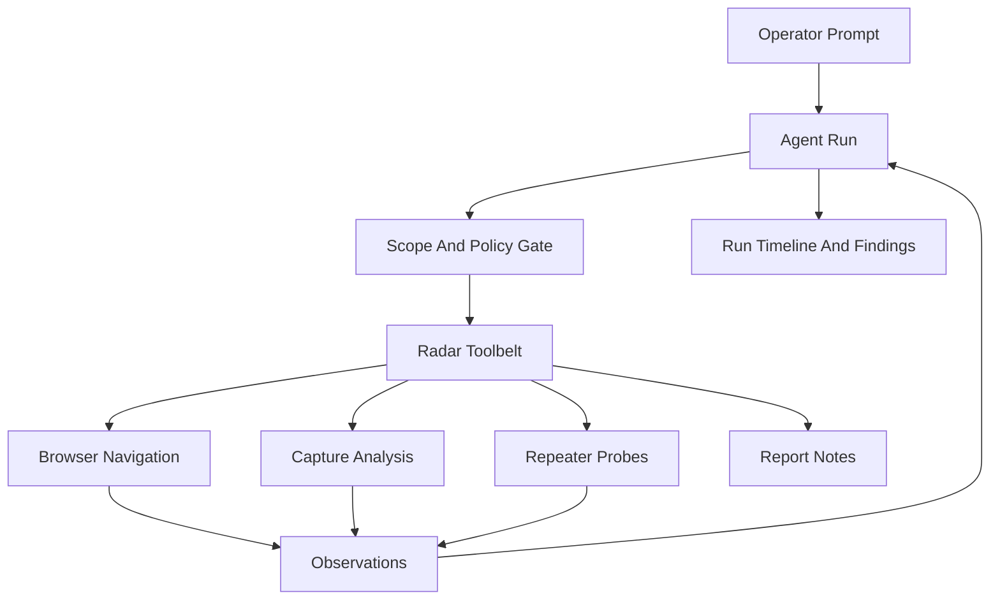

# Manual-First And AI-First Future Features

## Product Direction

Radar should support two top-level operating modes. **Manual-First** keeps the current operator-led workbench, where AI assists through summaries, drafts, checklists, and notes. **AI-First** makes prompts the primary control surface: the operator writes goals in natural language, and Radar turns them into scoped plans, browser actions, request analysis, repeater probes, and report notes. Human input in AI-First should be limited to prompts, scope setup, credentials the app cannot infer, and emergency stop.

At the time this plan was written, AI behavior was intentionally prepare-only in `electron/ai/tasks.ts`:

```29:35:electron/ai/tasks.ts
export function systemPrompt(task: AiTaskType) {
  return [
    "You are Radar, a defensive web security assistant embedded in a local-first workbench.",
    "You prepare analysis only; the operator executes all requests and navigation.",
    "Stay within authorized testing scope. Be concise and operational.",
    TASK_INSTRUCTIONS[task] || TASK_INSTRUCTIONS.capture_summary
  ].join("\n\n");
}
```

The short-term spec should replace that model with a mode toggle and two AI surfaces:

- **Manual-First Mode:** current Traffic, Repeater, Scope, and SSL workflow remains primary. AI stays assistive through Ask Mode and never executes actions without the operator clicking.
- **AI-First Mode:** prompt-driven agent runtime becomes primary. It can execute approved Radar actions directly inside scope, while the existing views become evidence panes.

## Mode Toggle

Add a persistent top-level toggle in the app shell:

- **Manual-First:** Default mode for existing users. Preserve the current layout, command palette, explicit replay buttons, and manual browser/repeater controls.
- **AI-First:** Replace the default landing area with the goal prompt and agent run console. Keep Traffic, Repeater, Scope, and SSL visible as inspectable supporting views.
- **Shared State:** Both modes use the same profile, session, targets, captures, proxy state, AI provider settings, and local storage.
- **Switching Behavior:** Switching from Manual-First to AI-First can start from the current session context. Switching away from AI-First should pause or stop active autonomous runs rather than letting them continue invisibly.
- **Preference:** Persist the last selected mode locally, but open new installs in Manual-First until the user chooses AI-First.

## Short-Term Future Features

1. **Goal Prompt Home**
   In AI-First mode, add a goal prompt above the existing views: “Test this target for common auth/session/API issues,” “Map this app,” “Generate report notes from this session,” etc. The prompt should create an agent run instead of requiring the user to choose Traffic, Repeater, Scope, or SSL first.

2. **Agent Run Console**
   Add a live run timeline showing goal, current step, tool calls, captures inspected, replay attempts, findings, uncertainties, and stop status. This becomes the primary UI only in AI-First mode.

3. **Scoped Toolbelt**
   Wrap existing `window.radar` capabilities from `shared/radar-api.ts` as typed agent tools: browser open/navigate/back/reload, capture snapshot, target management, replay send, burst replay, SSL review, and report-note generation.

4. **Session Memory Within Local Workspace**
   Persist agent runs locally alongside captures and sessions. Keep this local-first: no cross-session cloud memory, but allow Radar to remember prior run timelines, tested hypotheses, and dismissed findings within the local SQLite workspace.

5. **Autonomous Draft-To-Replay Loop**
   Promote “Repeater Drafts” from suggestions into an executable loop: select candidate capture, generate mutation, send replay, compare response, decide next mutation, record evidence.

6. **Findings Inbox**
   Convert agent observations into reviewable finding cards with evidence refs, confidence, impact, reproduction steps, and uncertainty markers. Findings can stay draft-only until the operator exports them.

7. **Run Profiles**
   Provide presets such as “Passive Map,” “Auth And Session Review,” “API Hardening,” “TLS/Proxy Review,” and “Full Scoped Sweep.” Each preset maps to allowed tools, replay budgets, and max runtime.

## Fully Autonomous Mode

Autonomous Mode should be a bounded agent loop in the Electron main process, not a renderer-only flow. The renderer displays state; the main process owns tools, limits, audit, and execution.



Core behavior:

- The user supplies a goal and scope, then the agent operates without per-action approval.
- Every network action must pass the existing allowlist logic in `shared/allowlist.ts`.
- Replay and burst actions must keep the existing hard caps from `electron/main.ts`, with stricter autonomous defaults.
- The agent can open and navigate the Radar browser, inspect captures, clone requests into replay drafts, send single replay probes, run capped bursts, and write findings.
- The agent cannot bypass scope, change provider credentials, trust certificates, erase evidence, or expand target scope unless the initial prompt explicitly included that target.
- Raw headers/bodies remain policy-controlled. Autonomous mode can use raw local context for local providers, but cloud providers should default to redacted context unless the run profile allows raw data.

## Implementation Shape

1. **Shared Contract**
   Add `AgentRun`, `AgentRunStatus`, `AgentToolCall`, `AgentFinding`, `AgentPolicy`, and `AgentRunRequest` types under `shared/`. Extend `shared/radar-api.ts` with `startAgentRun`, `stopAgentRun`, `getAgentRun`, and `listAgentRuns`.

2. **Main-Process Runtime**
   Add `electron/agent/` for the run loop, tool registry, policy checks, run persistence, and provider interaction. This layer should call existing browser, capture, replay, proxy, and AI provider functions instead of duplicating them.

3. **Policy Gate**
   Centralize autonomous checks: URL allowlist, method/body limits, replay budget, burst budget, max duration, max tool calls, raw-context policy, and blocked destructive actions.

4. **Renderer UI**
   Add a Manual-First / AI-First mode toggle and an AI-first run panel to `src/App.tsx`, then wire state through `src/hooks/useRadarWorkbench.ts`. In Manual-First, keep existing views as the primary controls. In AI-First, keep them as inspectable evidence panes around the run console.

5. **Prompting**
   Replace prepare-only autonomous prompts with a structured planner/executor protocol: plan next step, request one tool call, observe result, update findings, continue or stop. Keep existing command-palette prompts for Ask Mode.

6. **Persistence And Audit**
   Extend local storage so agent runs survive app restarts. The current AI audit in `electron/ai/audit.ts` is in-memory only; autonomous runs need durable local history.

## Safety Rules

- Scope is authoritative.
- The initial prompt can narrow scope, but not silently widen it.
- Autonomous replay must use smaller defaults than manual burst replay.
- Agent findings are draft findings until exported or accepted.
- Every tool call stores input summary, result summary, timestamp, and policy decision.
- Stop must be immediate and available from the run console.
- Switching out of AI-First while a run is active must pause or stop the run explicitly.
- Failed policy checks should be visible in the timeline instead of silently ignored.

## First Build Slice

Build the smallest useful autonomous loop:

- Prompt: “Inspect this scoped target and produce findings.”
- Tools: `getBrowserState`, `openBrowser`, `navigateBrowser`, `getCaptures`, `sendReplay`.
- No burst replay in the first slice.
- One run console with live timeline and stop.
- Top-level Manual-First / AI-First toggle with Manual-First as the default.
- Durable local run record.
- Tests for allowlist enforcement, replay budget enforcement, stop behavior, and run persistence.
